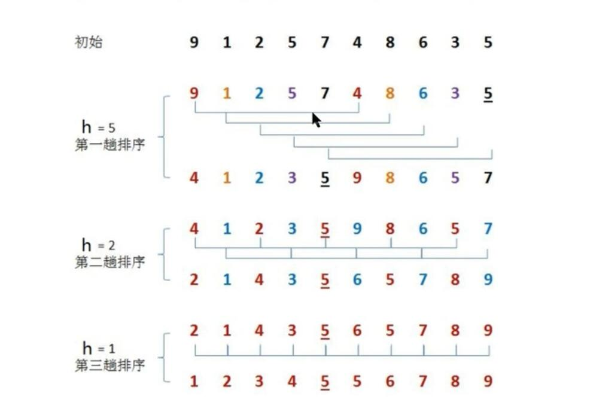
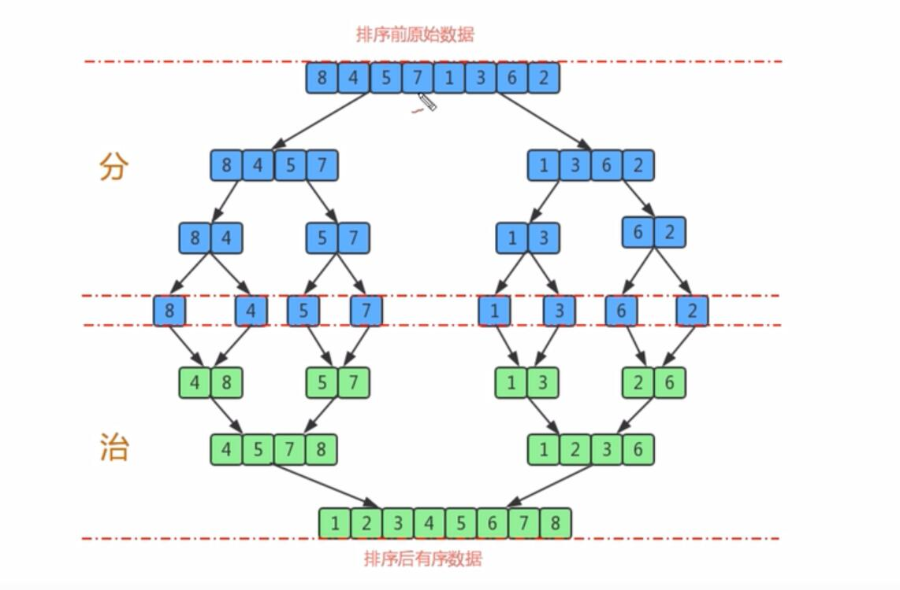

# 排序算法

## 插入排序

####  排序原理
1. 把所有的元素分为两组，已经排序的未排序的。

2. 找到未排序中的第一个元素，向已排序的组中进行插入。

3. 倒序遍历已经排序的元素，依次和待插入的元素进行比较，直到找到一个元素小于等于待排序元素，则把待插入元素放到这个位置，其后元素向后移动一位。

> 时间复杂度 2n + 2*(1+n) /2 * n --->n^2

#### 图解


#### 代码

```javascript

class Insert<T> {
    sortFn:Function
    sort(srcArr:Array<T>,sortFn:Function) {
        this.sortFn = sortFn
        for(let i = 1;i<srcArr.length;i++) {
            debugger
            for(let j=i-1;j>=0;j--) {
                if(this.greater(srcArr[i],srcArr[j])){
                    this.inset(srcArr,i,j+1)
                    break
                }
            }
        }
        return srcArr
    }
    greater(a:T,b:T) {
        if(this.sortFn) {
            return this.sortFn(a,b)
        }else {
            return  a >= b ? 1 :  0
        }
    }
    inset(srcArr:Array<T>,j:number,i:number) {
        let temp = srcArr[j]
        srcArr.splice(j,1)
        srcArr.splice(i,0,temp)
    }
}
let c = new Insert<string>();

```

## 冒泡排序

####  排序原理
1. 每次找到一个最大的放数组最右边，或每次找到一个最小的放数组最左边。

2. 经过arr.length趟循环，数组中相邻两个数进行比较，如果左边的更大，则交换位置。每次找出一个最大（或最小）放最右边（最左边）；

>  时间复杂度：2*((1+n）/2 * n)--->n^2

#### 图解


#### 代码

```javascript
class Bubble {
    sort(srcArr,sortFn) { //最大放右边
        this.sortFn = sortFn
        for(let i = 0; i<srcArr.length;i++) { 
            for(let j = 1;j<srcArr.length - i; j ++) { //每一趟能确定一个最大的放在最右边，这样下一趟已经排出的最大元素就不需要参与排序。所以是j<srcArr.length - i;
                if(this.greater(srcArr[j-1],srcArr[j])) {
                    this.exch(srcArr,j-1,j)
                }
            }
        }
        return srcArr
    }
    sortTwo(srcArr,sortFn) { //最小放左边
        for(let i=0;i<srcArr.length; i++) {
            for(let j = srcArr.length; i<j;j--){
                if(this.greater(srcArr[j-1],srcArr[j])){
                    this.exch(srcArr,j,j-1)
                }
            }
        }
        return srcArr
    }
    greater(a,b) {
        if(this.sortFn) {
            return this.sortFn(a,b)
        }else {
            return  a > b ? 1 :  0
        }
    }
    exch(srcArr,i,j) {
        let temp = srcArr[i]
        srcArr[i] = srcArr[j]
        srcArr[j] = temp;
    }
}
```

## 选择排序

####  排序原理
1. 每次遍历的过程都假定第一个索引处的元素是最小值，和其他索引处的值依次进行比较，如果发现其余索引某处的值小于假定最小值，则把改索引更新为最小值索引
2. ，这样每遍历完一次能找出一个最小值索引，与未排序部分的第一个值进行交换。

> 时间复杂度 2n + 2*(1+n) /2 * n --->n^2


#### 图解


#### 代码

```javascript
class Selection {
    sort(srcArr,sortFn) {
        this.sortFn = sortFn
        for(let i = 0; i<srcArr.length;i++) {
            let min = i; //初始假定最小数就在i位置
            for(let j = i+1;j<srcArr.length;j++) {
                if(this.greater(srcArr[min],srcArr[j])) {
                    min = j;
                    this.exch(srcArr,i,min)
                    
                }
            }
           
        }
        return srcArr
    }
    greater(a,b) {
        if(this.sortFn) {
            return this.sortFn(a,b)
        }else {
            return  a > b ? 1 :  0
        }
    }
    exch(srcArr,i,j) {
        let temp = srcArr[i]
        srcArr[i] = srcArr[j]
        srcArr[j] = temp;
    }
}
```

## 希尔排序

####  排序原理
1. 希尔排序是升级版的插入排序
2. 选定一个增长量h,按照增长量h作为数据分组依据，对数据进行分组。
3. 对分好组的每一组数据进行插入排序。
4. 减小增长量，最小减为1，重复第二步操作。

* 确定h
  > [5,7,8,9,10,4,7,6,9,11] 以h作为步长进行分组：如当h=3的时候可分为：[5,9,7,11] [7,10,6] [8,4,9] 三组，后再对这三组分别进行插入排序，后h = Math.floor(h/2)再进行以上操作。


#### 图解


#### 代码

```javascript
class Shell<T> {
    sortFn:Function
    public sort(srcArr:Array<T>,sortFun:Function):T[]{

        //根据数据srcArr的长度，确定增长量h的初始值步增：2h+1
        let h:number = 1;
        while(h<srcArr.length/2){ //确定h:固定方法
            h = 2*h+1;
        }

        while(h>=1) {
            for(let i = h;i<srcArr.length; i++) { 
                for(let j = i; j>=h; j-=h) {
                    if(this.greater(srcArr[j-h],srcArr[j])) { //如果j-h位置上的元素大于j位置上的元素则进行交换
                        this.exch(srcArr,j-h,j)
                    }else { //否则结束循环
                        break
                    }
                }
            }
            h = Math.floor(h/2)
        }
        
        return  srcArr;
    }
    private greater(a:T,b:T) {
        if(this.sortFn) {
            return this.sortFn(a,b)
        }else {
            return  a >= b ? 1 :  0
        }
    }
    private exch(srcArr:Array<T>,i:number,j:number) {
        let temp = srcArr[i]
        srcArr[i] = srcArr[j]
        srcArr[j] = temp;
    }
}
```

## 归并排序

归并排序是建立在归并操作上的一种有效的排序算法，该算法是采用分治法的一个非典型的应用，将已有序的子序列合并，得到完全有序的序列，既先使每个子序列有序再使子序有序，若将两个有序表合并成一个有序表，称为二路合并。


####  排序原理
1. 尽可能的一组数据拆分成两个元素相等的子组，并对每一个子组继续拆分，真到拆分后的每个子组的元素个数是1为止。
2. 将相邻的两个子组进行合并成一个有序的大组。
3. 不断的重复步骤2，直至最终只有一个组为止。


#### 图解


#### 代码

```javascript
class MergerSort<T> {
    sortFun:Function
    constructor(sortfn:Function) {
        if(sortfn){
            this.sortFun = sortfn;
        }
    }
    sort(src:Array<T>) {
        let lo = 0;
        let hi = src.length-1;
       this._sort(src,lo,hi)
        return src;
    }
    _sort(src:Array<T>,lo:number,hi:number) {
        if(hi<=lo) {
            return;
        }
        //拆分
        let min = lo + Math.floor((hi-lo)/2);
        this._sort(src,lo,min)
        this._sort(src,min+1,hi)
        //进行合并
        this.merger(src,lo,min,hi);
    }
    merger(src:Array<T>,lo:number,min:number,hi:number) {
        let temp:Array<T> = [];
        let t = 0;
        let i = lo;
        let j = min+1;
        while(i<=min&&j<=hi) {
            if(this.greater(src[j],src[i])) {
                temp[t] = src[i]
                i++
            }else {
                temp[t] = src[j]
                j++
            }
            t++
        }
        while(i<=min) {
            temp.push(src[i])
            i++
        }
        while(j<=hi) {
            temp.push(src[j])
            j++
        }
        src.splice(lo,hi-lo+1,...temp)
    }
    private greater(a:T,b:T) {
        if(this.sortFun) {
            return this.sortFun(a,b)
        }else {
            return  a >= b ? 1 :  0
        }
    }
}
```

## 快速排序