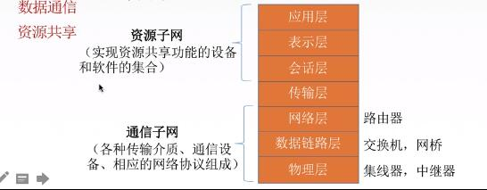

### 计算机网络：

计算机网络是一个将分散的、具有独立功能的`计算机系统`，通过`通信设备`与`线路`连接起来，由功能完善的软件实现`资源共享`和`信息传递`的系统。

> 计算机网络是`互连`的、`自治`的计算机集合。

> `互连`-互联互通 通信链路

> `自治` -无主从关系

### 计算机网络的功能：
1. 数据通信 （连通性，如发送文档）
2. 资源共享 （硬件共享，软件，数据）
3. 分布式处理 （多台计算机各自承担同一工作任务的不同部分，如Hadoop）
4. 提高可靠性 （替代机）
5. 负载均衡

### 计算机网络的组成

1. 组成部分：硬件、软件、协议
2. 工作方式：
 - 1. 边缘部分 用户直接使用（C/S方式，P2P方式）
 - 2. 核心部分 为边缘部分服务
3. 功能组成：
 - 1. 通信子网 实现数据通信
 - 2. 资源子网 实现资源共享/数据处理 
 

### 计算机网络的分类

1. 按分布范围分: 广域网WAN,城域网MAN，局域网LAN,个人区域网PAN
2. 按使用者分：公用网（中国电信，移动等），专用网（军队，政府）
3. 按交换技术分：电路交换，报文交换，分组交换
4. 按拓扑结构分：总线型，星型，环型，网状型（常用于广域网）
 
5. 按传输技术分：广播式网络（共享公共通信信道），点对点网络（使用分组存储转发和路由选择机制）

 

