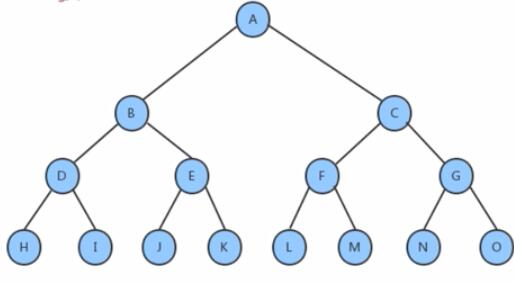
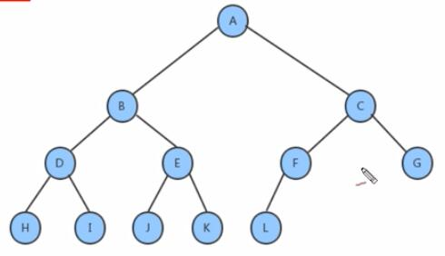
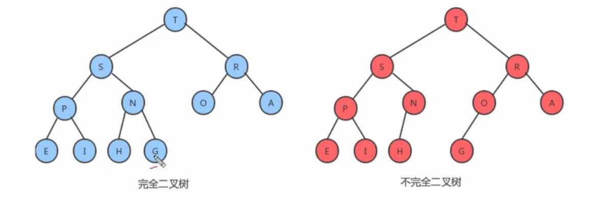
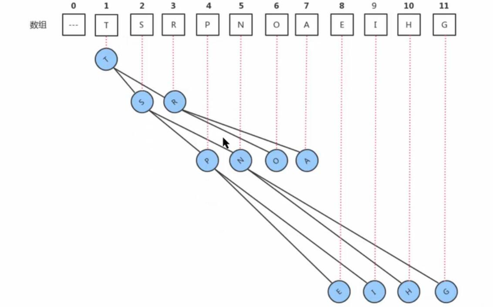
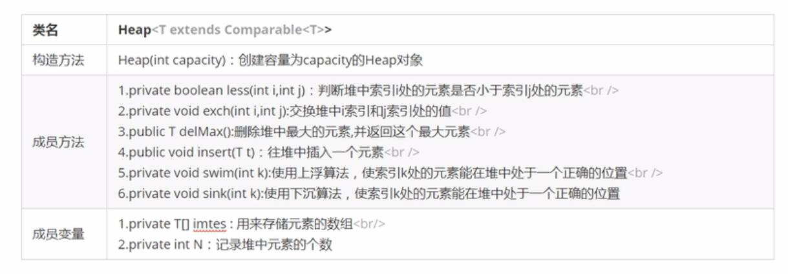

# 数据结构

### 二叉树

二叉树是度不超过2的树（每个节点最多有两个结点）

##### 满二叉树与完全二叉树

一个二叉树，如果每一层的结点树都达到最大值，则称之为满二叉树；

叶节点只能出现在最下层和次下层，并且最下面一层的结点都集中在该层的最左边的位置的二叉树，称之为完全二叉树；



 

<center>满二叉树</center>



<center>完全二叉树</center>

#### 节点对象API设计

| 类名     | Node<Key,Value>                                  |
| :------- | ------------------------------------------------ |
| 构造方法 | Node< key:Key,value:Value,left:Node,right:Node > |
| 成员变量 | left:Node,right:Node, key:Key, value:Value       |


## 堆

####  堆的定义

堆是计算机科学中一类特殊的数据结构的统称，堆通常可以被看做是一棵完全二叉树的数组对象。

##### 堆的特性：

1. 它是完全二叉树，除了树的最后一层结点不需要是满的，其它的每一层从左到右都是满的，如果最后一层结点不是满的，那么要求左满右不满。



2. 它通常用数组来实现。
具体方法就是将二叉树的结点按照层级顺序放入数组中，根结点在位置1，它的子结点在位置2和3，而子结点的子结点则分别在位置4，5，6，和7，以些类推。



####  堆的API设计



####  堆的实现

```javascript

```

