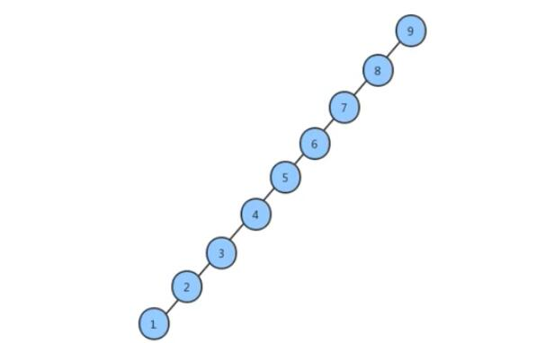
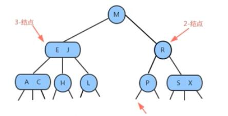
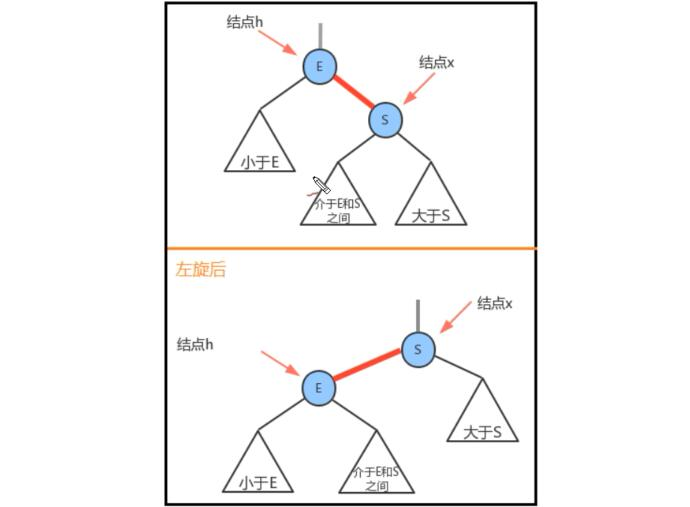
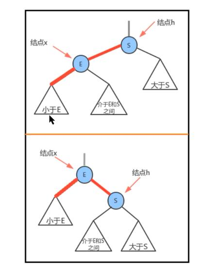

# 数据结构

## 平衡树

二叉查找树，大部分情况下查询效率确定很高，但在最坏情况，二叉查找树的性能还是很糟糕。例如以如下数据顺序往二叉树中插入：

9，8，7，5，4，3，2，1。会发现得到如下树：

我们会发现，如果我们查找1这个元素，效率会很低。原因在于这个树`不平衡`，全部在左边分支。

## 2-3查找树

为了保证查找树的平衡性，我们需要一些灵活性，因此这里我们允许树中的一个结点保存多个键。确切的说，我们将一棵标准二叉查找树中的结点称为2-结点（含有一个键和两条链），现在我们引入3-结点（含有二个键，三条链）。

### 定义：

一个2-3查找树要么为空，要么满足下面两个要求：

##### 2-结点：

含有一个键（及其对应的值）和两条链，左链接指向2-3树中的键都小于该结点，右链接指向的2-3树中的键都大于该结点。

#####　3-结点：

含有两个键（及其对应的值）和三条链，左链接指向的２－３树中的键都小于该结点，中链接指向的２－３树中的键都位于该结点的两个键之间，右链接指向的２－３树中的键都大于该结点。

## 红黑树

### 定义：

红黑树本质就是一个2-3查找树，我们用节点标红的方式来表示一个3-结点。红黑树另一等价定义满足二叉树的同时：

1，红链接均为左链接

2，不能存在连续两个左链接都为红色，

3，该树是完美黑色平衡的，即任意空链接到根结点的路径上的黑链接数量相同。

### 保证树的平衡性方法：

#### 左旋：

当对树进行操作后，导致右子节点颜射变为红色结点时，需要左旋。

1，让X的左子结点变为h的右子结点：x.right = h.left;

2,让h成为x的左子结点：x.left = h;

3,让h的color属性变为x的color属性值：x.color = h.color

4,让h的color属性变为RED：h.color = true;

####　右旋：

当某个结点的左子节点是红色，且左子结点的左子结点也是红色，需要右旋。

1. 让x的右子结点成为h的左子结点：h.left = x.right;

2. 让h成为x的右子结点：x.right = h;

3. 让x的color变为h的color属性值x.color = h.color;

4. 让h的color为RED