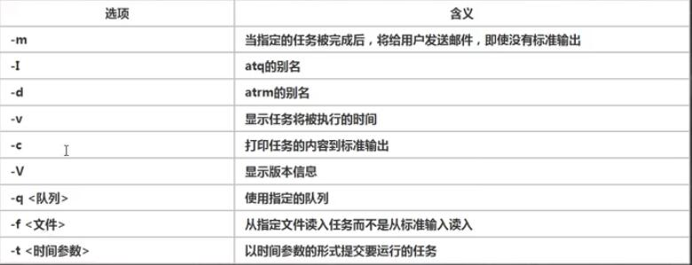

## at 定时任务
- 【at命令】是一次性定时计划任务，at的守护进程`atd`会以后台模式运行，检查作业列来运行。
- 默认情况下，atd守护进和每60秒检查作业队列，有作业时，会检查作业运行时间，如果时间与当前时间匹配，则运行此作业。
- at命令是一次性定时计划任务，执行完一个任务后不再执行此任务了，
- 在使用at命令的时候，一定要保证atd进行启动，可以使用相关指令来查看。
    
    > `ps -ef | grep atd` 查看当前进程状态再通过grep查找atd相关。

## at命令格式

- 【at 选项 时间】
- 按【ctrl + D 】两次，结束at命令的输入

- 【时间】说明：
  - 接受在当天的`hh:mm`(小时：分钟)式的时间指定。假如该时间已经过去了，那么放在第二天执行。
  - 使用`midnight(深夜)`,`noon（中午）`,`teatime（饮茶时间，一般是下午4点）`等比较模糊的词语来指定时间。
  - 采用12小时计时制，即在时间后面加上AM，PM来说明上午还是下午，例如:`12pm`
  - 指定命令执行的具体日期，指定格式为month day(月 日)，或mm/dd/yy(月/日/年)或`dd.mm.yy`,指定日期必须跟在指定时间后面。例如：04:00 2021-03-1
  - 使用相对计时法，指定格式为 `now + count time-units`; `time-units`为时间单位，这里能够使用的有:`minutes`,`hours`,`days`,`weeks`.例如: `now + 5 days`
  - 直接使用`today(今天)`，`tomorrow`来指定完成命令的时间。

- 【atq】命令来查看系统中有没有执行的工作任务。
- 【atrm 5】删除at任务(这里是序号为5的任务)

## 案例

> 【at 5pm + 2 days】两天后的下午5点执行。
> 【at 5pm + tomorrow】明天的下午5点执行。
> 【at now + 2 minutes】两分钟以后
