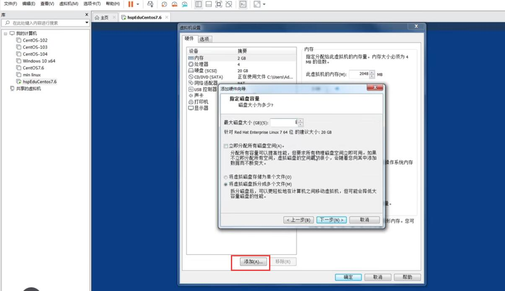
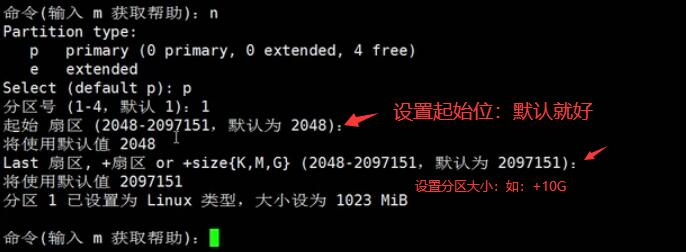

## Linux 分区

  - 【lsblk】查看所有设备挂载情况。
    - 【-f】查看分区格式方式及uuid。

  - 硬盘说明：
   - Linux硬盘分IDE硬盘和SCSI硬盘，目前基本上是SCS硬盘
   - 对于IDE硬盘，驱动器标识符为"`hdx`~",其中“hd”表明分区所在设备的类型，这里是指IDE硬盘了。“x”为盘号（a为基本盘，b为基本从属盘，c为辅助主盘，d为辅助从属盘），"~"代表分区，前四个分区用数字1到4表示，它们是主分区或扩展分区，从5开始就是逻辑分区，例如: `hda3`表示为第一个IDE硬盘上的第三个主分区或扩展分区，`hdb2`表示为第二个IDE硬盘上的第二个主分区或扩展分区。
   - 对于SCSI硬盘则标识为“`sdx`~”,SCSI硬盘是用“sd”,来表示分区所在设备的类型，其余则和IDE硬盘的表示方式一样。

### 案例

  - 虚拟机添加硬盘：
   

  - 硬盘分区：
    - 【fdisk /dev/sdb】 进行硬盘分区
      - 【-m】显示命令列表
      - 【-p】显示磁盘分区 同 fdisk -l
      - 【-a】添加新分区
      - 【-m】显示命令列表

      

  - 格式化分区：
    - 【mkfs -t ext4 /dev/sdb1】 对sdb1进行格式化，其中`ext4`为分区类型

  - 挂载分区：

    - 【mount /dev/sdb1 /newdisk】 将`sdb1`挂载到/newdisk目录
    - 【umount `/dev/sdb1` | umount `/newdisk`】 取消`sdb1`挂载

  >ps 通过上面这种挂载方式重启后会失效


  -  永久挂载：
    - 通过修改`/etc/fstab`实现挂载，添加如下一行：
    
```bash
    /dev/sdb1    /newdisk      ext4   defaults   0  0
```

  - 添加完成后执行 【mount -a】即刻生效。

## 磁盘情况查询及相关实用指令

- 【df -h】 查询磁盘分区容量情况及使用情况
- 【du /home】查询指定目录的磁盘占用情况，默认为当前目录。
    - 【-s】指定目录占用大小 汇总。
    - 【-h】带计量单位
    - 【-a】含文件
    - 【--max-depth=1】子目录深度
    - 【-c】列出明细的同时，增加汇总值。

### 案例

- 查询统计`/opt`文件的数量。
```bash
ls -l /opt | grep "^-" | wc -l
```
- 查询统计`/opt`目录的数量。
```bash
ls -l /opt | grep "^d" | wc -l
```
- 查询统计`/opt`文件的数量包含子目录的。
```bash
ls -lR /opt | grep "^-" | wc -l
```
- 以树状显示`/opt`目录。
```bash
tree /opt
```

