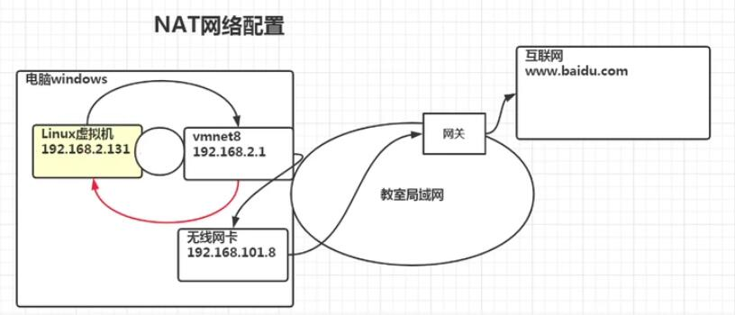

## NET网络原理图



## 指定IP

 - 直接修改配置文件来指定IP并可以连接到外网,通过编辑：
  > /etc/sysconfig/network-scripts/ifcfg-{网络名称}
  >
  > /etc/network/interfaces （ubuntu 的配置文件）

  ```bash
  BOOTPROTO=static //改成静态 ，原来值：`dhcp`为动态分配
  IPADDR=192.168.1.100 //这行没有自行添加，指定IP
  ```

  - 修改完之后`service network restart` 或 `reboot` 重启网络服务

## 网络相关指定

 - 【ifconfig】 查看IP信息
 - 【hostname】 查看主机名

## 修改主机名
  - 修改文件`/etc/hostname`；修改后重启生效。

## 修改hosts

  - 修改文件`/etc/hosts`.
  ```bash
  #关联主机名
  127.0.0.1 yourhostname 
  ```

## DNS

 - 当输入`www.baidu.com`后发生了什么？ 
   - 浏览器先检查浏览器缓存中有没有该域名解析IP地址，有就先调用这个IP完成解析;如果没有，就检查DNS解析器缓存，如果有直接返回IP完成解析。这两个缓存，可以理解为本地解析器缓存。
   - 一般来说，当电脑第一次成功访问某网站后，在一定时间内，浏览器或操作系统会缓存他的IP地址（DNS解析记录）。windows下面通过以下命令查看和清除：
        ```bash
        # 查看 
        ipconfig /displaydns
        #清除
        ipconfig /flushdns

        ```
   - 如果本地解析器缓存没有找到对应映射，检查系统中`hosts`文件中有没有配置对应的域名IP映射，如果有则完成解析。
   - 如果`hosts`中也没有找到，则到域名服务DNS进行解析域。
