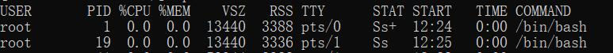
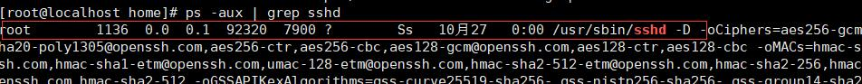

## 进程管理
 - 【ps】 用于查看目前系统中，有哪些正在执行的进行。
   - 【-a】显示当前终端的所有进程信息
   - 【-u】以用户的格式显示进程信息
   - 【-x】显示后台进程运行的参数
   

 说明：
   - `System V` 展示风格
   - `USER`:用户名称
   - `PID`:用户名称
   - `%CPU`:进程占用CPU的百分比
   - `%MEM`:进程占用物理内存的百分比
   - `VSZ`:进程占用的虚拟内存大小（单位：KB）
   - `RSS`:进程占用的物理内存大小（单位：KB）
   - `TT`:终端名称，缩写。
   - `STAT`:进程状态，其中`S`-睡眠，`s`-表示该进程是会话的先导进程，`N`-表示进程拥有比普通优先级更低的优先级，`R`-正在运行，`D`-短期等待，`Z`-僵死进程，`T`-被跟踪或者被停止等等。
   - `STARTED`:进程的启动时间
   - `TIME`:CPU时间，即进程使用CPU的总时间。
   - `COMMAND`:启动进程所用的命令和参数，如果过长会被截断显示。

- 【kill】和【killall】停止或杀死进程。
    - 【kill 选项 进程号】 通过进程号杀死进程。
    - 【kill 进程名】 通过进程名杀死所有相关进程（可以使用通配符）这在系统因负载过大面变得很慢时很有用。
    - 【-9】表示强迫进程立即停止。

    - 案例：
      - 踢掉某个非法登录用户。
        ```bash
        ps -aux | grep sshd  //查看使用sshd的服务找到相关用户进程

        kill [相关进程ID]

        ```
      - 终止远程登录服务`sshd`,在适当时候再次重启`sshd`服务。
          ```bash
          ps -aux | grep sshd
          ```
          

          ```bash
            kill 1136
          ```
          重新启动
           ```bash
            /bin/systemctl start sshd.service
          ```

      - 终止多个gedit。
        
        ```bash
         ps -aux | grep gedit //查看gedit相关进程
         killall gedit //杀死所有gedit相关进程

        ```
       
      - 强制杀掉一个终端。

        ```bash
        ps -aux | grep bash //查看正在使用命令窗口进程的PID
        kill -9 pid   //带上-9表示强制终止
        ```

- 【pstree】以树状形式显示进程
  - 【-p】显示进程的PID
  - 【-u】显示进程的所属用户。

  ```bash
   pstree -pu
  ```