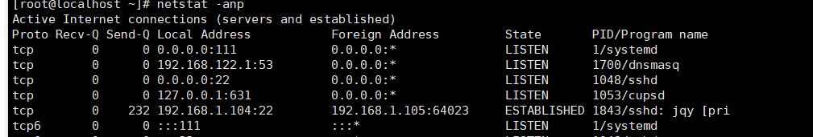

## 动态监控进程

- 介绍：`top`与`ps`命令很相似，它们都用来显示正在执行的进程，top与ps最大的不同之处，在于top在执行一段时间可以更新正在运行的进程。

- 【top 选项】 查看正在执行的进程。
   - 【-d 秒数】 指定top命令每隔几秒更新，默认是3秒
   - 【-i】使top不显示任何闲置或者僵死进程。
   - 【-p】 通过指定监控进程ID来仅仅监控某个进程状态。
- 【top】的监控状态下，输入以下选项可以进行排序和退出。
   - 大写的`P`:以CPU使用率排序，默认就是此项。
   - 大写的`M`:以内存的使用率排序。
   - 大写的`N`:以PID排序。
   - 小写的`q`:退出。

- 案例：

   - 监视特定用户
      ```bash
      #输入top进入监控状态
      top
      #在监控状态按':u'
      :u
      #在输入要监控的用户名
      root
      ```
   - 终止指定的进程
     ```bash
     #输入top进入监控状态
     top
     #在监控状态按':k'
     :k
     #在输入要终止的PID
     1018
     ```

- 【netstat】查看系统网络情况
  - 【-an】按一定顺序排列输出
  - 【-p】 显示哪个进程在调用

    

    > `Foreign Address` 指正与本地地址通信的远程IP及端口


- 【ping】测试域名及IP是或是通的。

   