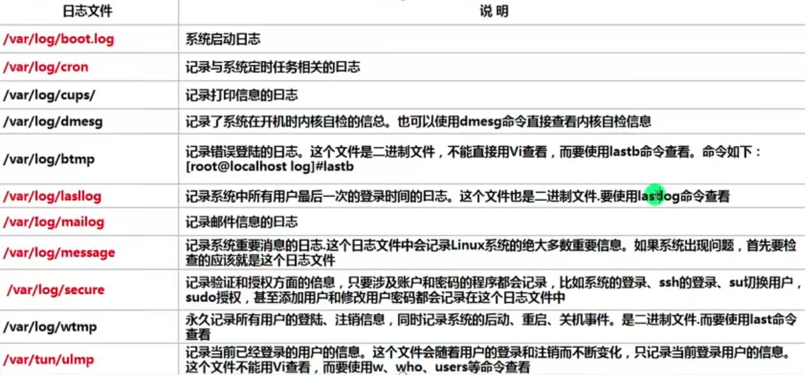

## 日志管理

- 系统常用日志
  

- 日志管理程序
  - 【rsyslogd】centOS7.6日志服务
  - 【syslogd】centOS6.x日志服务
    - `rsyslogd`功能更强大，并用兼容`syslogd`服务
  - 查询`rsyslogd`服务是否启动：`【ps aux | grep "rsyslog" | grep -v "grep"】  `
  - `rsyslogd`的配置文件`/etc/rsyslog.conf`
    - 这个文件配置了rsyslogd写日志的规则，如上图系统常用日志生成的日志文件。
  - 查询`rsyslogd`服务的自启动状态`【systemctl list-unit-files | grep rsyslog】`

- 配置文件`/etc/rsyslog.conf` 解读：
  - 编辑文件时的格式为：`*.*`,存放日志文件
  - 其中第一个`*`代表日志类型，第二个`*`代表日志级别
  - 日志类型分为:
    - `auth` ---- pam产生的日志
    - `authpriv` ---- ssh,ftp等登录信息的验证信息
    - `corn` ---- 时间任务相关
    - `kern` ---- 内核
    - `lpr` ---- 打印
    - `mail` ---- 邮件
    - `mark(syslog)-rsyslog` ---- 服务内部的信息，时间标识
    - `news` ---- 新闻组
    - `user` ---- 用户程序产生的相关信息
    - `uucp` ---- unix to nuix copy主机之间相关的通信
    - `local 1-7` ---- 自定义的日志设备

  - 日志级别：
    - `debug` --- 有调试信息的，日志通信最多
    - `info` --- 一般信息日志，最常用
    - `notice` --- 最具有重要性的普通条件的信息
    - `warning` --- 警告级别
    - `err` --- 错误级别，阻止某个功能或者模块不能正常工作的信息
    - `crit` --- 严重级别，阻止整个系统或者整个软件不能正常工作的信息
    - `alert` --- 需要立刻修改的信息
    - `emerg` --- 内核崩溃等重要信息
    - `none` --- 什么都不记录

     > 注意：从上到下，级别从低到高，记录信息越来越少。

  - 自定义配置
    - 在`/etc/rsyslog.conf`里加上一行：

     ```bash
     #不区分类型跟级别，所有日志都写进`jekion.log`
      *.*                  /var/log/jekion.log
     ```

  - 全局日志轮替策略
    - 我们可以对产生的日志进行有规则定时地进行转移并改名，同叶建立新的空日志文件，当旧日志文件超出保存的范围之后就会进行删除 。
    - `/etc/logrotate.conf` 全局日志轮替策略，也可以单独指定
      - 如果文件中有`dateext`参数，那么日志会用`日期`来作为日志作为日志轮替文件的后缀.如果没有则只是简单地在文件后面加上1，2等加以区别。
    - `/etc/logrotate.conf`解读：
      - 参数说明：
      
      | 参数 | 说明 |
      | ---- | ---- |
      | daily | 日志的轮替周期是每天 |
      | weekly | 日志的轮替周期是每周 |
      | monthly | 日志的轮替周期是每月 |
      | rotate | 保留的日志文件的个数。0指没有备份 |
      | compress | 日志轮替时，旧的日志进行压缩|
      | create mode owner group | 建立新日志，同时指定新日志的权限与所有者和所属组 |
      | mail address | 当日志轮替时，输出内容通过邮件发送到指定的邮件地址 |
      | missingok | 如果日志不存在，则忽略该日志的警告信息 |
      | notifempty | 如果日志为空文件，则不进行日志轮替 |
      | minsize |  日志轮替的最小值，也就是日志一定要达到这个最小值才会轮替，否则就算时间达到也不轮替。 |
      | size | 日志只有大于指定大小才进行日志轮替，而不是按照时间轮替 |
      | dateext | 使用日期作为日志轮替文件的后缀 |
      | sharedscripts | 在此关键字之后的脚本只执行一次 |
      | prerotate/endscript | 在日志轮替之前执行脚本命令 |
      | postrotate/endscript | 在日志轮替之后执行脚本命令 |

    -案例：
      ```bash
       # 每周对日志文件进行一次轮替
        weekly

        # 共保存4份日志文件，当建立新的日志文件时，旧的将会被删除
        rotate 4

        # 创建新的空的日志文件，在日志轮替后
        create

        # 用日期作为日志轮替文件的后缀
        dateext

        # uncomment this if you want your log files compressed
        #compress

        # 包含/etc/logrotate.d目录下面的子配置文件
        include /etc/logrotate.
        
        # 对特定日志单独设置，优先级更高
        /var/log/wtmp {
          # 每月对日志文件进行一次轮替
          monthly
          # 建立的新日志文件权限是0664，所有者是root 所属组是utmp
          create 0664 root utmp
          # 日志文件最小轮替大小是1M,若不超过则即使超过一个月也不进行转储
          minsie 1M
          # 仅保留一个日志备份，也就是只有wtmp和，wtmp.1日志保留而已
          rotate 1

        }
        /var/log/btmp {
          # 如果日志不存在，则忽略该日志的警告信息
          missingok
          monthly
          create 0664 root utmp
          rotate 1
        }

      ```
- 查看内存日志
  - 【journalctl】 可以查看内存日志，这里我们年看常用的指令
  - 【journalctl】 查看全部
  - 【journalctl -n 3】 查看最新3条
  - 【journalctl --since 19:00 --until 19:10:10】查看起始时间至结束时间的日志可加日期 
  - 【journalctl -p err】 报错日志
  - 【journalctl -o verbose】日志详细内容。
  - 【journalctl _PID=1245 _COMM=sshd】 查看包含这些参数的日志
  - 【journalctl | grep sshd】 用grep过滤
