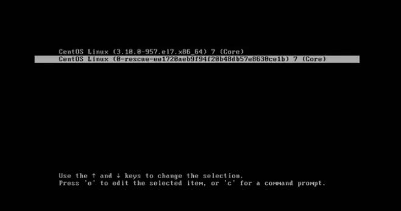
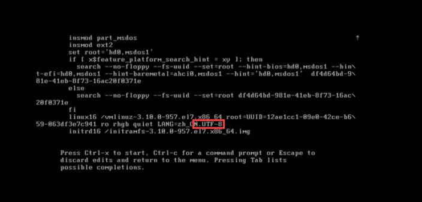
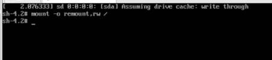
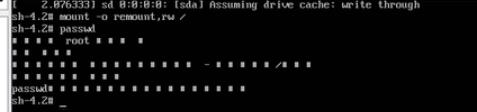

## 找回root密码

- 在启动时，看到如下界面按`e`:

 

- 在如下界面`UTF-8`处输入 ： ` init=/bin/sh` 注意前面留空格，后按【ctrl+x】进入单用户模式

 

- 在单用户模式输入：`mount -o remount,rw /` 回车。

 

- 后再输入：`passwd` 完成后按键盘的回车键，输入密码，再次输入确认即可。

 

- 后再输入：`touch /.autorelabel` 完成后按键盘的回车键。
- 后再输入：`exec /sbin/init` 完成后按键盘的回车键。完成后，系统会自动重启，新的密码生效。
