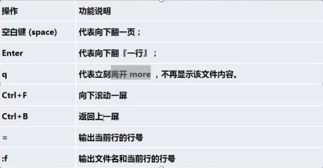
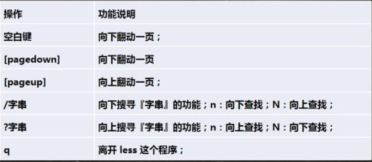

## 文件目录类指令

- 【pwd】显示当前目录的绝对路径
- 【ls】显示目录信息
  - 【-a 参数】 : 显示当前目录所有的文件和目录，包括隐藏的。
  - 【-l 参数】 : 以列表的方式显示信息

- 【cd】 切换到目录
- 【mkdir】创建目录
  - 【-p】创建多级目录

- 【rm】删除目录或文件
  - 【-r】递归删除
  - 【-f】强制的删除

> rm -rf /xxx/rrr

- 【touch】创建一个空文件
- 【cp】拷备文件到指定目录
  -  【-r】递归复制整个文件夹

> cp -r /aa/cc /bb/dd  拷备/aa/cc目录及其子文件和目录至/bb/dd

> cp -r /aa/cc/* /bb/dd  拷备/aa/cc目录下的子文件和目录至/bb/dd

- 【mv】指令；移动文件与目录或重命名

- 【cat】指令：查看文件内容
  - 【-n】显示行号
  - 为了查看方便一般会再接个管道命令 `| more`
    > 如 ： cat myfile.txt | more

- 【more】指令，是一个基于VI编辑器的文本过滤器，它以全屏幕的方式按页显示文本文件的内容。
  有以下交互的指令（快捷键）
  

- 【less】指令;less指令用于分屏查看文件内容，它的功能与more指令类似，但是比more指令更加强大，支持各种显示终端，less指令在显示文件内容时，并不是一次将整个文件加载之后才显示，面是根据显示需要加载内容，对于显示大型文件具有较高的效率。

- 【echo】指令 输出内容到控制台
  - 如：输出环境变量: `echo $PATH`,`echo $HOSTNAME`
- 【head】指令 用于显示文件的开头部分内容，默认情况下head指令显示文件的前10行内容。
     - 【-n】 指定行数 `head -n 5 aa.txt`

- 【`>` 和 `>>`】指令 输出重定向和追加。
   如：

   - 【`ls -l > aa.txt`】 :列表的内容写入文件aa.txt（覆盖写）。
   - 【`ls -al >> aa.txt`】 :列表的内容写入文件aa.txt（追加写）。
   - 【`cat bb.txt > aa.txt`】 :将文件bb.txt的内容覆盖到文件aa.txt。
   - 【`echo "hello world" > aa.txt`】 :将'hello world'件aa.txt。

- 【tail】 指令，用于输出文件中尾部的内容，默认情况下tail指令显示文件的后10行内容。
  如：
  - 【tail aa.txt】 查看文件尾10行内容。
  - 【tail -n 5 aa.txt】 查看文件尾5行内容。
  - 【tail -f aa.txt】 `实时追踪该文件的所有更新`

- 【ln】指令 软链接也称符号链接，类似于windows里的快捷方式，主要存放了链接其他文件的路径
  -【ln -s [原文件或目录] [软链接名]】 

- 【history】指令 查看已经执行过历史命令，也可以执行历史命令。
 - 【history 10】 查看最近的10条
 - 【!5】执行编号为5的历史指令