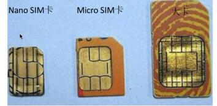
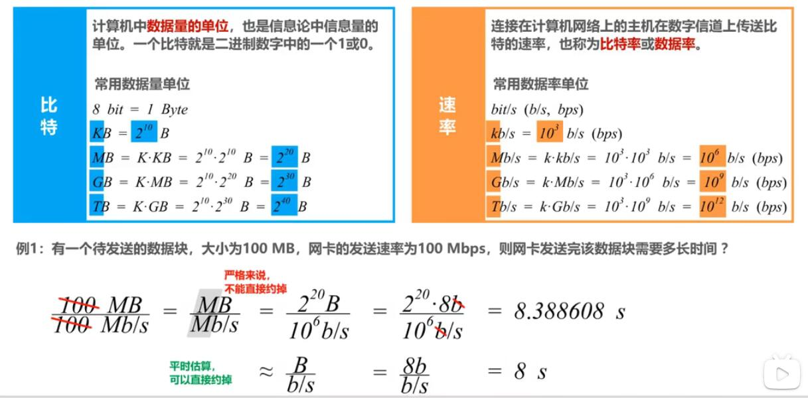
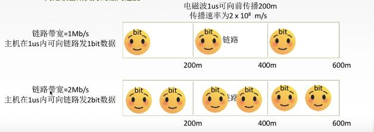

# 标准化工作
分类：
1. 法定标准：由权威机构制定的正式的、合法的标准OSI
2. 事实标准：某些公司的产品在竞争中占据了主流，时间长了这些产品中的协议和技术就成了标准。如：TCP/IP，及苹果的Nano SIM 卡

 

 ### `RFC`(Request For Comments) ----因特网标准的形式

 RFC要上升为因特网正式标准的`四个阶段`:
  - 1.<b>因特网草案</b>(internet draft) 这个阶段还不是RFC文档
  - 2.<b>建议标准</b>（Proposed Standard）从这个阶段开始成为RFC文档。
  -3.因特网正式标准

### 标准化工作的相关组织

1. 国际标准化组织ISO （OSI参考模型，HDLC协议）
2. 国际电信联盟ITU （制定通信规则）
3. 国际电气电子工程师协会IEEE （学术机构、IEEE802系列标准、5G）
4. Internet工程任务组IETF （负责因特网相关标准的制定 RFC等）

## 计算机网络的性能指标

### 速率

速率即`数据率`或称`数据传输率`或`比特率`

比特构成：1/0 位

连接在计算机网络上的主机在数字信道上传送数据位数的速率。

单位是：b/s,kb/s,Mb/s,Gb/s,Tb/s

#### 速率与存储容量换算的区别：
 

### 带宽

1) "带宽"原本指某个信号具有的频带宽度，即最高频率与最低频率之差，单位是`赫兹`（Hz）
2) 计算机网络中，带宽用来表示网络的通信线路传送数据的能力，通常是单位 时间内从网络中的某一点到另一点所通过的“最高数据率”，单位是“比特每秒”，b/s,kb/s,Mb/s,Gb/S。网络设备所支持的最高速度。

 

 ### 吞吐量

 - 吞吐量表示在`单位时间内通过某个网络（或信道、接口）的数据量`
 - 吞吐量被经常用于现实世界中的网络的一种测量，以便知道实际上到底有多少数据量能够通过网络。
 - 吞吐量受网络的带宽或额定速率的限制。

 ### 时延

 网络时延由三部部分构成，它们是：发送时延，传播时延和处理时延。
 1）发送时延 = 分组长度（b）/ 发送速率（b/s）
 2) 传播时延 = 信道长度（m）/ 电磁波传播速率（m/s）[自由空间为光速：3*10^8 m/s,铜线：2.3*10^8 m/s，光纤：2*10^8 m/s]
 3）处理时延：不方便计算

  

问题：在传输过程中如果忽略处理时延，是发送时延还是传播时延占主导？

  

### 时延带宽积

> 时延带宽积 = 传播时延 * 带宽

1) 若发送端连续发送数据，则在所发送的第一个比特即将到达终点时，发送端就已经发送了`时延带宽积`个比特
2) 链路的时延带宽积又称为`以比特为单位的链路长度`

### 往返时间

- 在许多情况下，因特网上的信息不仅仅单方向传输，而是双向交互;
- 我们有时很需要知道双向交互一次所需的时间。
- 因此，往返时间`RTT（Round-Trip Time）`也是一个重要的性能指标。

### 利用率

1) `信道利用率`：用来表示某信道有百分之几的时间是被利用的（有数据通过）。
2）`网络利用率`：全网络的信道利用率的加权平均。

- 根据排队论，当某信道的利用率增大时，该信道引起的时延也会迅速增加。
- 因此，`信道利用率并非越高越好`
- 如果令`D0`表示网络空闲时的时延，`D`表示网络当前的时延，那么在适当的假定条件下，可以用下面的简单公式来表示`D`,`D0`和利用率`U`之间的关系：
> D = D0 / (1-U)

 

 由图可以看出：
 
 - 当网络和利用率达到50%时，时延就要加倍。
 - 当网络和利用率超过50%时，时延急剧增大。
 - 当网络和利用率接近100%时，时延就趋于无穷大了。
 - 因此一些拥有较大主干网的ISP通常会控制它们的信道利用率不超过50%。如果超过了就要准备扩容，增大线路的带宽。

也不能使信道利用率太低，这会使宝贵的通信资源被白白浪费。应该使用一些机制，可以根据情况动态调整输入到网络中的通信量，使网络利用率保持在一个合理的范围内。

### 丢包率

- 丢包率即分组丢失率，是指在一定时间范围内，传输过程中`丢失的分组数量与总分量数量的比率`。
- 丢包率具体可分为接口丢包率、结点丢包率、链路丢包率、路径丢包率、网络丢包率等。
- 丢包率是网络运维人员非常关心的一个网络性能指标，但对于普通用户来说往往并不关心这个指标，因为他们通常意识不到网络丢包。
- 分组丢失主要有两种情况：
  1） 分组在传输过程中出现`误码`，被结点丢弃；
  2） 分组到达一台队列已满的分组交换机时被丢弃。在通信较大时就可能造成`网络拥塞`.
- 因此，丢包率反映了网络的拥塞情况：
  1）无拥塞时路径丢包率为0.
  2）轻度拥塞时路径丢包率为1%~4%
  3）严重拥塞路径丢包率为5%~15% 

