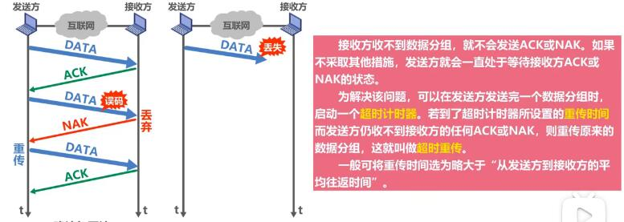
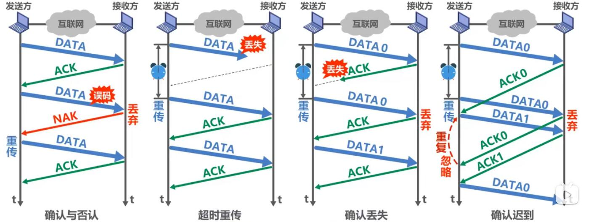
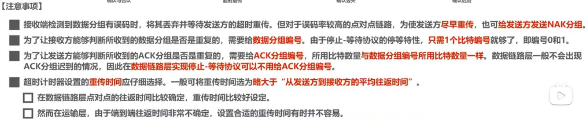
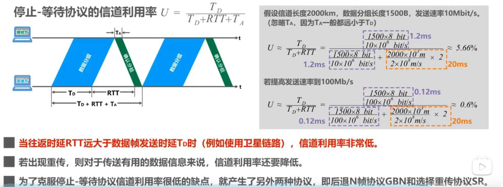
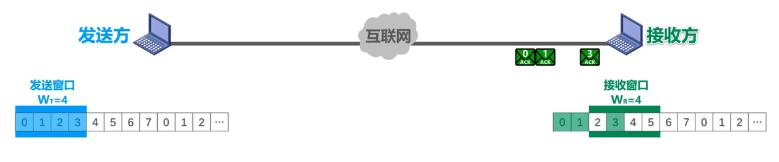
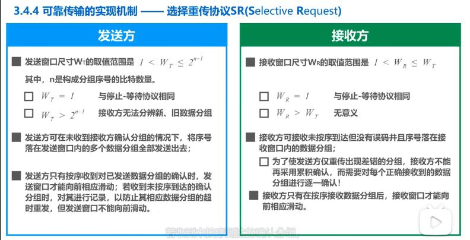

## 可靠传输的实现机制

- 停止-等待协议SW

    - 发送方发送完一个数据分组后，不会立即发送下一个分组，需要等待接收方的确认分组或否认分组；如果接收方发的是否认分组，则发送方需要重新发送未接收成功的分组。可见在收到接收方发送的确认分组之前，发送方需要缓存刚发送的分组。直至分组接收成功。
    - 如果发现丢包怎么办，为解决这个问题，可以在发送完一个数据分组时，启动一个`超时计时器`。若到了超时计时器所设置的重传时间数据分组，这就叫做`超时重传`。一般可将重传时间选为略大于"从发送方到接收方的平均往返时间"
     
    - 如果`接收方发送的确认分组丢失`呢? 发送方则会因为超时重复发送分组；为了`避免分组重复`这种传输错误，必须给`每个分组带上序号`。对于停止-等待协议，由于每发送一个数据分组就停止等待，只要保证每发送一个新的数据分组，其发送序号与上次发送的数据分组的序号不同就可以了，因此用`一个比特来编号就够了（即0和1）`.
    - 如果`接收方发送的确认分组`超时呢？（即大于重传时间发送方才接收到该确认分组）这样发送方必定会`重传该分组`。之后超时的`确认分组`到达，接收方发达下一个分组;到这里我们便会发现问题。如下图第四种情况，解决办法就是给`确认分组也加上序号`
    
    

    - `停止-等待协议的信道利用率问题`
    

- 回退N帧协议GBN

    - 采用3个比特给分组编序号，即序号`0~7`
    - 需要一个发送窗口，发送窗口尺寸记作: MT,取值如下：
    $$
     1< W_T <= 2^n-1
    $$
    - 其中`n`代表采用多少个比特给分组编码。这里是3
    - 接收方的接收窗口尺寸记作： WR 值为`1`

    ### 无差错情况下：

    发送方以`0-7`序号，有序发送，假设数据分组（0，1，2，3，4）`按序`到达接收方，接收方按序接收分组，因为接收窗口尺寸为1，每接收一个分组，向前滑动一格，直到所有分组都正确接收，后再发送确认分组，正确接收多少个分组则发送多少个确认分组；发送方每正确接收一个确认分组，发送窗口向前滑动一格。
     - 累积确认：接收方不一定要对收到的数据分组逐个确认；而是对`按序`到达的最后一个分组发送确认。`ACKn`表示序号为n及以前的所有数据分组都已经正确接收。这种确认方式的优点在于，部分确认分组丢失也不影响发送方的确认。
        举例：如发方有序发送了1，2，3，4，5个分组，接收方在收到1，2时发送了一个ACK2确认发组，收到3，4，5后再发送个ACK5确认分组，但ACK2在传输过程中丢失了，发送方正确收到了ACK5确认分组。则认为前面5个分组都正确接收了。ACK2未能接收不影响。发送方的确认。

    ### 有差错情况下:
        
    假设接收方正确接收的最后一个分组序号为4,发送方接下来发送`5,6,7,0,1`,5号发生误码，接收方对其丢弃，继续接收6，但6与此时的接收窗口（序号为5）序号不匹配，则也被丢弃，同理7，0，1也被丢弃；接收方再连接发送4（5因为是误码不被计在其中）个ACK4确认分组。这4个ACK4经过传输到达发送方，因为之前发送方已经接收过ACK4。于是就是确认之前发送的（即4号之后发送的）分组有问题，重新发送。

    - 由上面例子可知：尽管序号为6，7，0，1的分组正确到达接收方，但因为5号误码 不被接受，它们也"受到牵连”，不被接收，发送方还要重传p-些数据分组，这就是所谓`GO-back-N`(回退N帧)，可见，当通信线路质量不好时，`回退N帧协议的信道利用率并不比停止-等待协议高 `。

    - `回退N帧协议GBN`接收窗口只能为1，因此`接收方只能按序接收正确到达的数据分组`；
    - 一个数据分组的误码就会导致其后续多个数据分组不能被接收方按序接收而丢弃（尽管它们无乱序和误码）。这必然会造成发送方对这些数据分组的超时重传，显然这是对通信资源的极大浪费。
    - 为了进一步提高性能，可设法只重传出现误码的数据分组，因此，接收窗口的尺寸WR不应再等于1（而应大于1），<strong>以便接收方先收下失序到达但无误码并且序号落在接收窗口内的那些数据分组</strong>,等到所缺失分组收齐后再一并送交上层，这就是下面要讲的`选择重传协议`

- 选择重传协议SR

    - 采用3个比特给分组编序号，即序号`0~7`
    - 需要一个发送窗口，发送窗口尺寸记作: MT,取值如下：
    $$
     1< W_T <= 2^n-1
    $$
    - 其中`n`代表采用多少个比特给分组编码。这里是3
    - 接收方的接收窗口尺寸记作： WR 
    $$
     1< W_R <= W_T
    $$
    
    `一般与发送方窗口尺寸一样；`
    
    - 下面例子发送窗口取值为4，接收窗口尺寸也为4.
     
     

      假设到达接收方时，2号分组数据丢失;其他正确到达的分组会被接收方接收:`步骤：0,1分组接收，接收窗口向前滑动两格，3号分组接收，因不是连续的，接收窗口不能向前滑动。接收方发出0，1，3的确认分组。发送方收到确认分组，接到一个有序的确认分组向前滑动一格，0，1确认分组接收完后，发送窗口到达4，5，接着就把4，5分组数据发送出去，并删除0，1分组缓存。接收方也可以择机把0，1分组数据交付给上层处理；3号确认分组到达发送方，接收方标记已接收，但发送窗口不能滑动，4，5分组正确到达接收方，因为2号分组导致不连续，接收方接收4，5分组，但接收窗口不能滑动，接着发送4，5确认分组给发送方，发送方收到4，5确认分组，但不能向前滑动发送窗口，假设在这过程中，2号分组因超时计时器超时被发送方重传，接收方接收收到2号分组，并可以一次向前滑动4个窗口，到达6，7，0，1;2号确认分组到达发达方，同理发送方收到2号确认分组一次可以向前滑动4个格子到达6，7，0，1`，。

      > 发送窗口： WT 或接收窗口： WR 等于1则与回退N帧一样。发送窗口： WT > 2n-1则会使接收方无法分辨新，旧数据分组。

      

>ps： 这三种可靠传输实现机制的基本原理并不仅限于数据链路层，可以yi8et到计算机网络体系结构的各层协议中。不因只局限在数据链路层。
