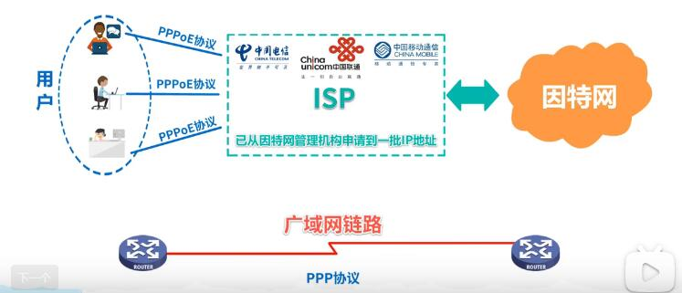
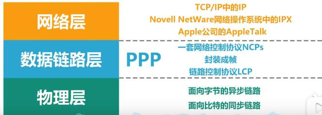
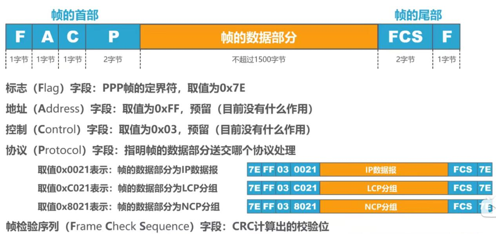
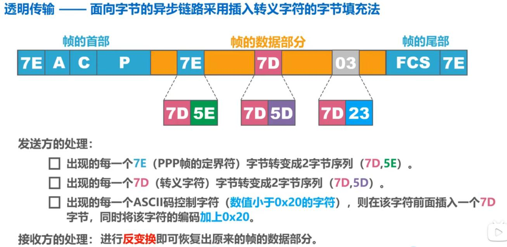
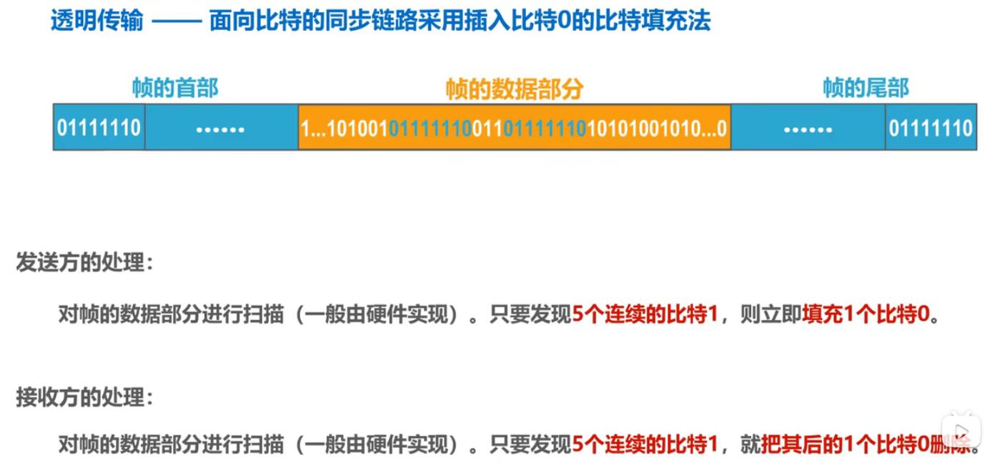
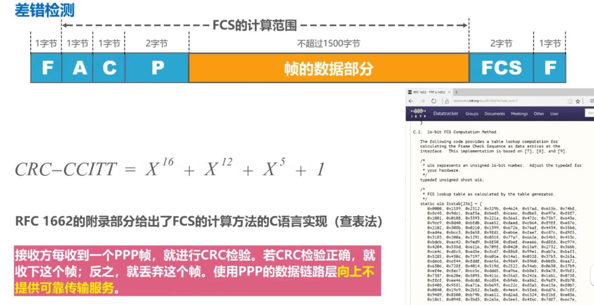

## 点对点协议ppp

 - 点对点协议PPP（Point-to-Point Protocol）是目前使用最广泛的点对点数据链路层协议。
 - PPP协议是因特网工程任务组IETF在1992年制定的，经过1993年和1994年的修订，现在的PPP协议已成为因特网的正式标准[RFC1661,RFC1662]

   

 - ppp协议为在点对点链路传输各种协议数据报提供了一个标准方法，主要由以下三部分构成：
   - 对各种协议数据报的封装方法（前面说的`封装成帧`）
   - 链路控制协议LCP； 用于建立、配置以及测试数据链路的连接。
   - 一套网络控制协议NCPs  其中每一个协议支持不同的网络层协议。
    

 - 点对点协议PPP帧格式

   

- 当传输数据中出现了`定界符`，怎么办？这里分`异步传输`,`同步传输`两种情况:
  - `异步传输` 处理方式:

     

   - `同步传输` 处理方式:

     
- PPP协议的差错检测
  
- PPP协议的工作状态
  

