## 媒体接入控制的基本概念

 - 共享信道要着重考虑的一个问题就是如何协调多个发送和接收站点对一个共享传输媒体的占用，即`媒体接入控制MAC`(Medium Access Control)
 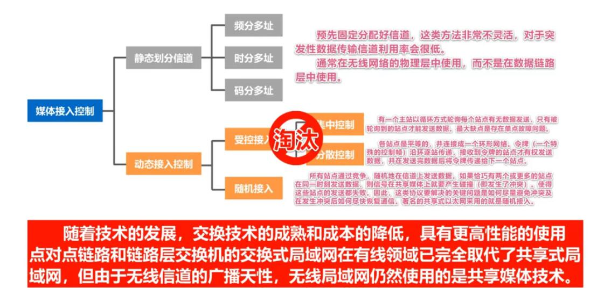
## 静态划分信道
   - 复用（Multiplexing）是通信技术中的一个重要概念。复用就是通过一条物理线路同时传输多路用户的信号。
   - `当网络中传输媒体的传输容量大于多条单一信道传输的总通信量时`，可利用复用技术在一条物理线路上建立多条通信信道来充分利用传输媒体的带宽。如下图

     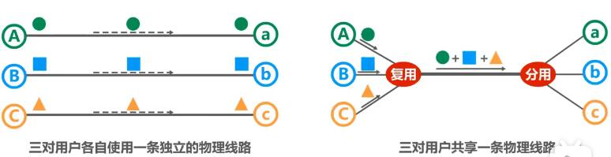

   - 常见的信道复用技术有：
     - 频分复用FDM：

        复用器将发送的每路信号调制到不同频率的载波上，接收端由相应的分用器通过滤波将各路信号分开。
        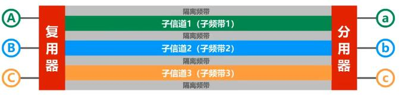

        显然：`频分复用的所有用户同时占用不同的频带资源并行通信`

     - 时分复用TDM：
        将传输线路接时隙轮流分配给不同的用户，用户只能在相应时隙里使用线路传输数据；我们将时隙的一个周期称作为：`TDM帧`.
        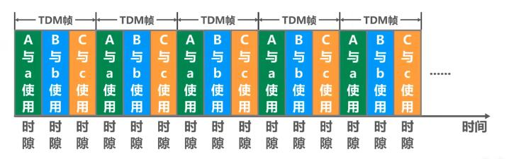

        显然：`时分复用的所有用户在不同的时间占用同样的频带宽度`

     - 波分复用WDM：
        波分复用就是`光的频分复用`
        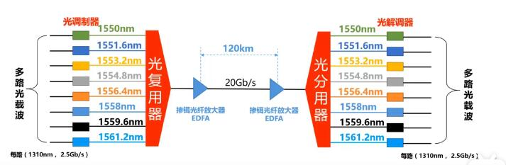

     - 码分复用CDM：
       码分复用CMD是另一共享信道的方法，实际上，由于该技术主要用于多址接入，人们更常用的名词是码分多址CDMA(Code Division Multiple Access)。

        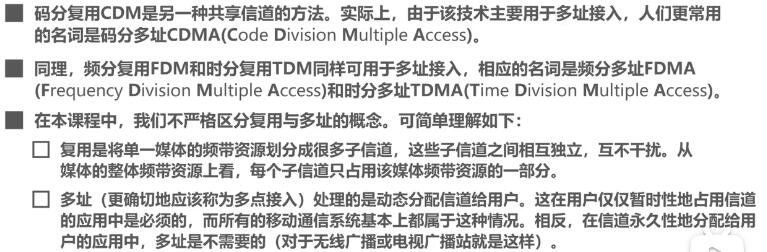

          > 某种程度来说：频分多址（FDMA）,时分多址（TDMA）,码分多址（CDMA）可以分别看成是FDM,TDM,CDM的应用。

       - 与FDM和TDM不同，CDM的每一个用户可以在`同样的时间使用同样的频带进行通信`。因为`各用户使用经过特殊挑选的不同码型`因此各用户之间`不会造成干扰`。
       - 因采用CMD所发送的信号有很强的抗干扰能力，类似于白噪声，不易被发现，最初用于军事通信。后随着技术的进步，CDMA设备的价格和体积都大幅下降，因而现在已广泛用于民用的移动通信中。

      - 码分复用原理及`码片`挑选原则：
        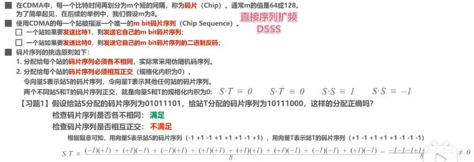
        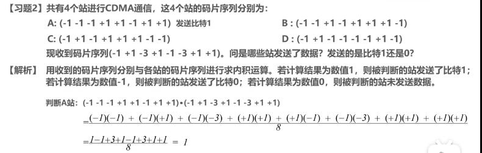

## 动态接入控制

   - 随机接入

     - 载波监听多址接入/碰撞检测 (`CSMA/CD`)(Carrier Sense Multiple Access/Collision Detection)
     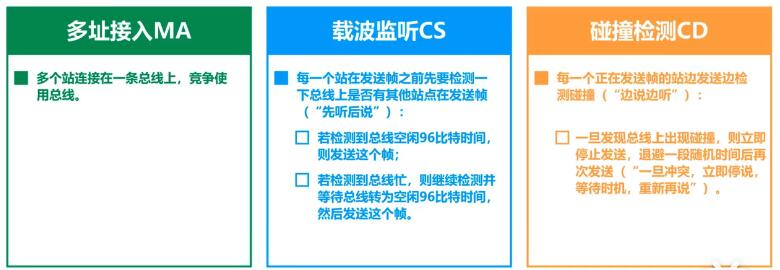

     - 原理说明：多台主接入一根总线（多址接入MA）,每台主机都实时进行`载波监听CS`及`碰撞检测CD`假设B主机监听到信道空闲96比特时间时，立即发送帧；发送一半，C主机也监听到信道空闲96比特时间，也立即发送帧，此时必定信号在总线上会发生碰撞，碰撞后离碰撞点近的主机先检测到碰撞，停止发送，退避一段随机时间，后再发送此帧；此后B也检测到碰撞与C同理。
     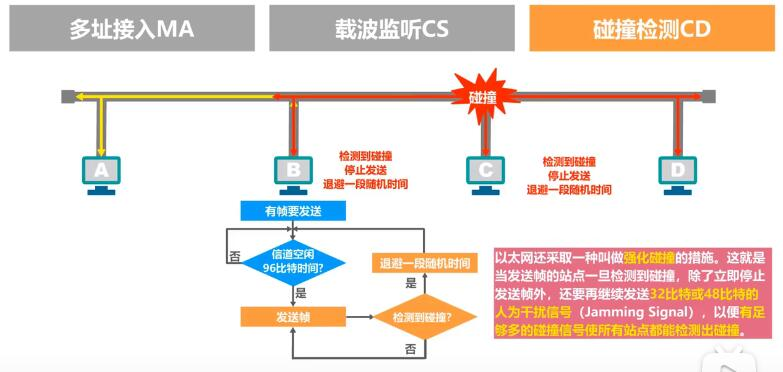

     - CSMA/CD协议--争用期(碰撞窗口)
       - 如下图总线型网络，A~D（相距最远）主机，发送数据的时序图,A在t=0时发送信息。
       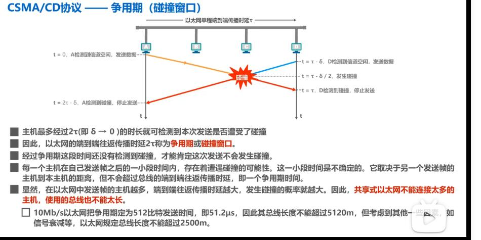
       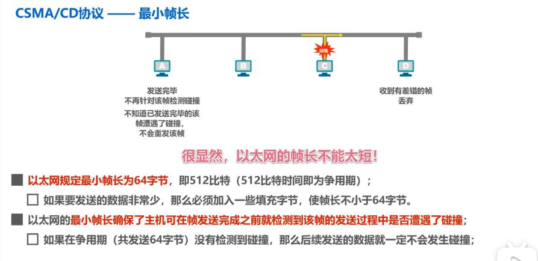

     
