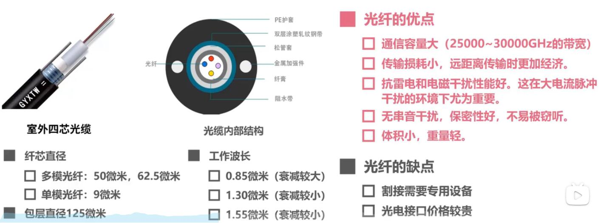
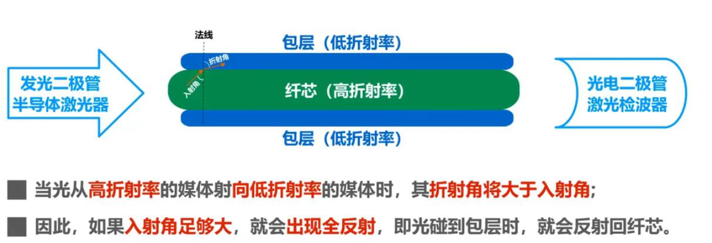
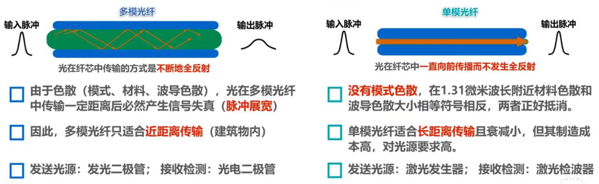
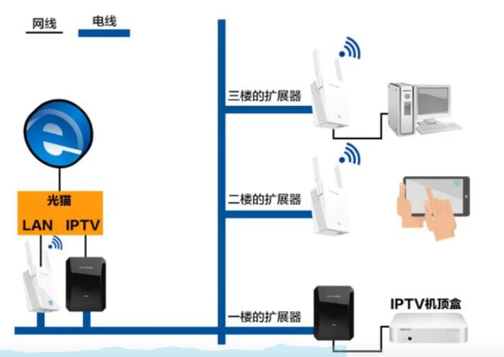
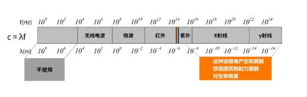
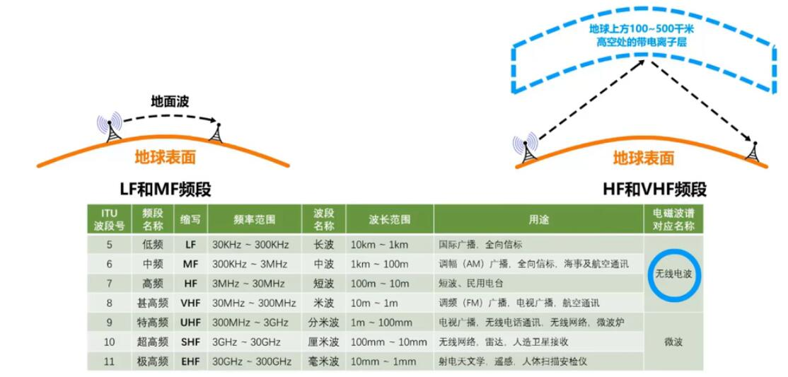
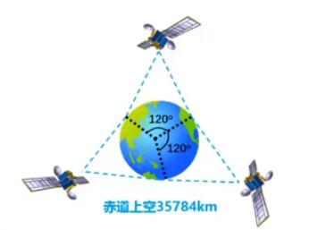
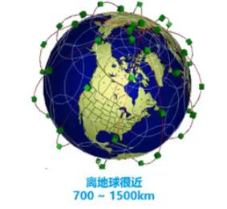

# 物理层

## 物理层的基本概念

 - 物理层考虑的是怎样才能在连接各种计算机的传输媒体上传输数据比特流。

 - 物理层为数据链路层屏蔽了各种传输媒体的差异，使数据链路层只需要考虑如何完成本层的协议和服务，而不必考虑网络具体的传输媒体是什么。

   

## 物理层下面的传输媒体

> 注意：传输媒体不属于OSI网络体系结构中的任何一层。

### 主要包括以下两类：

- 导引型传输媒体：`【同轴电缆】`,`【双绞线】`,`【光纤】`,`【电力线】`

  - 同轴电缆

  - 双绞线
  
  - 光纤
  

    * 光纤传输原理
    
    * 多模光纤和单模光纤
     

  - 电力线

    早在20世纪20年代初期就出现了电力线传输信号，应用电力线传输信号的实例最早的是`电力线电话`;目前，如果要构建高性能家庭局域网`电力线传输是不能满足要求的`，对于装修时没有进行网络布线的家庭，可以采用这种方式，还有就是对于有独立办公室的公司，且每间办公司的电脑不多，又不希望跨办公室进行布线的，可以采用电力线。
    

- 非导引型传输媒体：`【无线电波】`,`【微波】`,`【红外线】`,`【可见光】`

  

  - 无线电波
   
    无线电波的：`低频（LF）`和`中频(MF)`，主要利用地面波进行传输。
    无线电波的：`高频（HF）`和`甚高频(VHF)`，主要利用电离层的反射进行传输。
    

  - 微波

     微波主要是直线传播，因为它会穿透电离层，所以不能靠电离层反射进行传输。
      
      微波通信的几种方式：

      - 地面微波接力通信（`传统`）：
        
        > 由于微波是直线传播，但地球是曲面的，所以传输距离为50km左右，但如果采用100m的天线塔，传输距离可以达到100km左右;所以需要每隔`50~100km`建立中继站。中继站作用主要是接力和放大信号。

      - 卫星通信（`传统`）：

        特点通信距离远，但同时传播时延也比较大，一般在`250~300ms`之间。
        
 
      - 低轨道卫星通信系统（`前卫`）：
        在离地球很近（700~1500km）的轨道部署多颗卫星，构成空间高速链路.
        

  - 线外线通信
    特点：
      - 点对点无线传输。
      - 直线传输，中间不能有障碍物，传输距离短。
      - 传输速率低（4Mb/s~16Mb/s）

    常见家庭`电器遥控`。

  - 可见光通信（`还处于实验研究中`）

    `LIFI`技术，利用LED端的高频闪烁（这种闪烁肉眼无法察觉）与其他设备通信。

  
### 无线电频谱管理机构：

要使用某一段无线电频谱进行通信,   通常必须得到本国政府有关无线电频谱管理机构的许可证；
     
     - 我国的无线电频谱管理机构是工信部无线电管理局。

      
        
