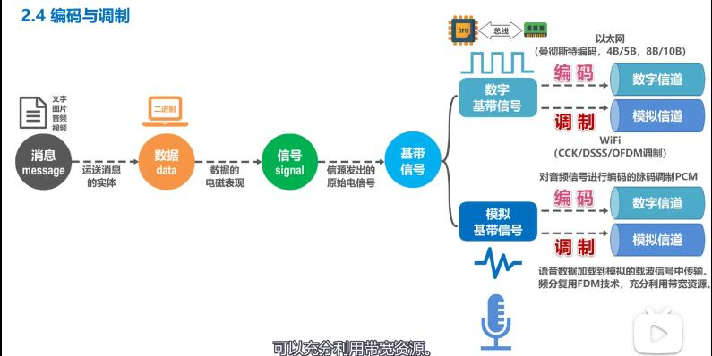
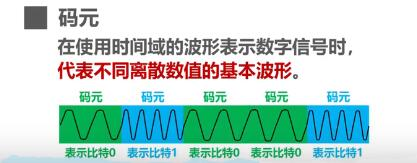
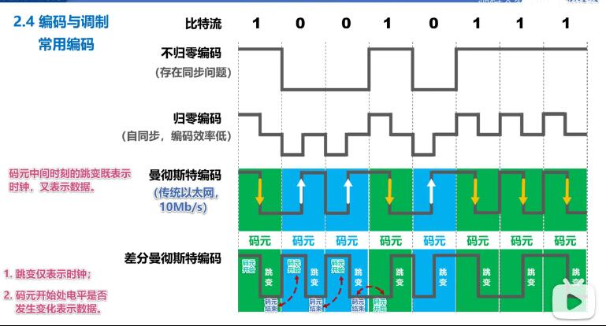

## 编码与调制

 在计算网络，计算机需要处理传输用户的文字，图片，音频，和视频。数据（二进制）是运送消息的实体;再由网卡把数据变换成电信号（数据的电磁表现）发送到网线；由信源发出的原始电信号我们称为`基带信号`。
   - 基带信号分为：`数字基带信号`和`模拟基带信号`。

     - 数字基带信号
     
     > 在不改信号性质的前提下,仅对数字基带信号的波形进行变换，称为`编码`,编码后产生的信号仍为数字信号（如以太网使用`曼彻斯编码`，`4B/5B`,`8B/10B`）

     > 把数字基带信号的频率范围搬移到较高的频段并转换为`模拟信号`,我们称为`调制`，调制后产生的信号称为`模拟信号`（如:WIFI使用补码键控、直接序列扩频、正交频伊利用等调制方法）

     - 模拟基带信号

       对于模拟基带信号的处理也有编码和调制两种方法：
       `编码`典型的应用如：对音频信号进行编码的`脉码调制PCM`,也就是将音频信号通过采样，量化，编码这三个步骤进行数字化。
       
       `调制`典型的应用如：电话-将语音数据加载到模拟的载波信号中传输;另一个是频分复用FDM技术，可以充分复用带宽资源。

## 码元
 在使用时间域的波形表示数字信号时，`代表不同离散数值的基本波形`我们称为`码元`. 简单来说码元就是构建信号的一段波形。
   

## 传输媒体与信道的关系
  
  传输媒体与信道之间并不能直接划等号：

  单工通信中：传输媒体中只能有一条信道，要么是发送信息，要么是接收信道。
 
  对于半双工和全双工：要包含两条信息：发送和接收信道。

  如果是使用复用技术：一条传输媒体可以包含多个信道。

## 常用编码方式：
  
   - 不归零编码
       - 正电平为`1`,负电平为`0`,但要解决一个同步问题：我们怎么知道一段连续的正或负电平中有几个1和0。这个时间就需要另一信道专门负责时钟信号。这样便浪费了一条信道。所以不归零编码一般不采用。

   - 归零编码

        - `每个码元传输结束后信号都要"归零"`，所以接收方只要在信号归零后进行采样即可，不需要单独时钟信号。
        - 实际上，归零编码相当于把时钟信号用“归零”方式编码在了数据之内这称为“自同步”信号。
        - 但是，归零编码中大部的数据带宽都用来传输“归零”而浪费掉了。

    - 曼彻斯特编码
       码元中间时刻发生跳变，跳变即表示时钟，又表示数据。（传统以太网10Mb/s使用的就是曼彻斯编码）
    - 差分曼彻斯特编码
      码元中间时刻发生跳变;跳变仅表示时钟，码元`开始处电平`是否发生变化表示数据。相比`曼彻斯特编码`，差分曼彻斯特编码变化少，更适合较高的传输速率。
        
    
    

## 基本调制方法
 如下图所示，对数字基带信号采用`调幅（AM）`，`调频（FM）`,`调相（PM）`基本调制方法进行调制得到的波形。
 

