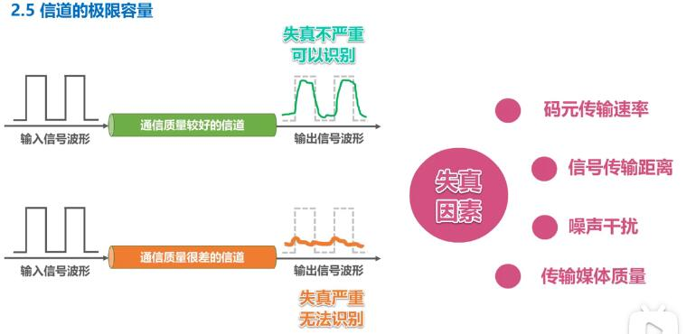
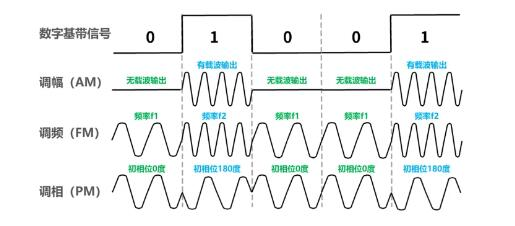
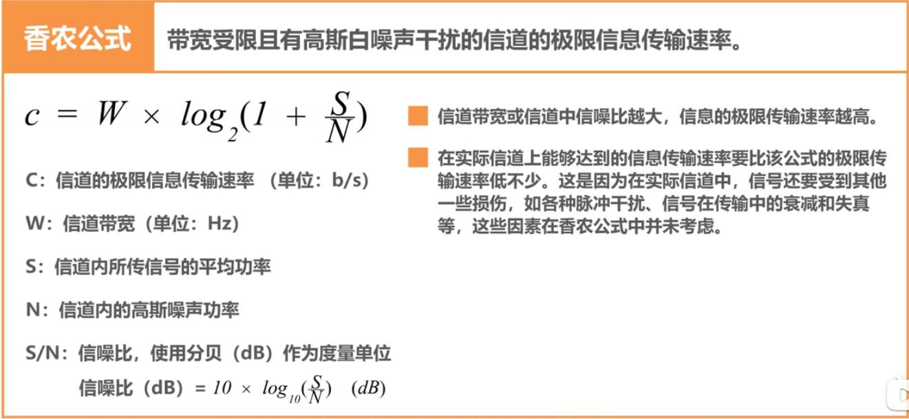
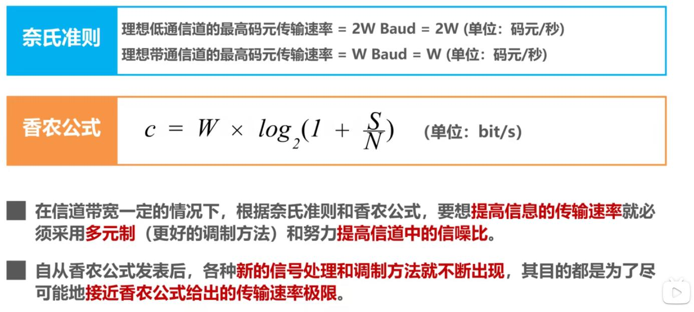

## 信道的极限容量

- 码元失真
  
   失真的原因有：
    - 码元传输速率。
    - 信号传输距离。
    - 噪声干扰。
    - 传输媒体质量。
     

- 奈氏准则

  在假定的理想条件下，`为了避免码间串扰，码元传输速率是有上限有。`

  - 理想低通信的最高码元传输速率 = 2W Baud = 2W 码元/秒
  - 理想带通信的最高码元传输速率 = W Baud = W 码元/秒
   > `W`:信道带宽（单位为Hz）. `Baud`:波特，即码元/秒

   码元传输速率（又称：波特率，调制速率，波形速率或符号速率）与比特率有一定的关系：

     - 当1个码元只携带1个比特的信息量时，则波特率（码元/秒）与比特率（比特/秒）在数值上是相等的。
       如前面介绍的基本调制方式：
       
     - 当1个码元携带n比特的信息量时，则波特率转换成比特率时，数值要乘以n.
       如前面介绍的混合调制`QAM-16`

   要提高 信息传输速率（比特率），就必须高潮使每一个码元能携带更多个比特的信息量。这需要采用多元制。

   `在实际的信道中所能传输的最高码元速率，要明显低于奈氏准则的这个上限数值。` 因为奈氏准则是在理想的条件下，不考虑 信号传输距离、噪声干扰、传输媒体质量。

   问：只要采用更好的调制方法，让码元可以携带更多的比特，岂不是可以无限制地提高 信息的传输速率？
   
   答：答案是否定的，因为信道的极限信息传输速率还要受限于实际的信号在信道中传输时的`信噪比`。信道中的噪声也会影响接收端对码元的识别。并且噪声功率相对信号功率越大，影响就越大。

- 香农公式

  

综合奈氏准则及香农公式，我们可以得出提高信息的传输速率方法：
 

