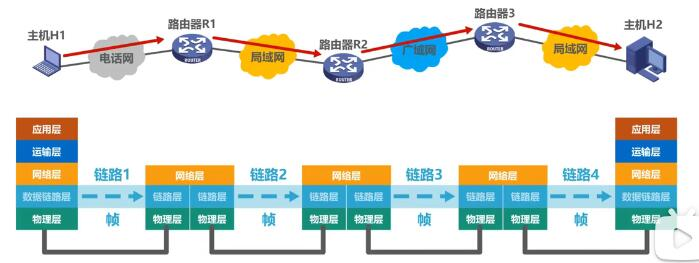
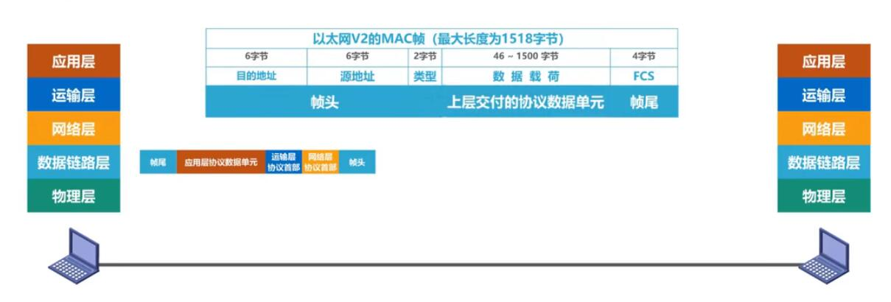

## 数据链路层概述

 - `链路（Link）`就是从一个结点到相邻结点的一段物理线路，面中间没有任何其他的交换结点。
 - `数据链路（Data Link）`是指实现通信协议的硬件和软件加到链路上，就构建了数据链路。
 - 数据链路层以`帧`为单位传输和处理数据。
  

### 数据链路层的三个重要问题

 - 封装成帧
     
     数据链路层将网络层交付的协议数据单元添加帧头和帧尾的操作，称为封装成帧;目的是为了在链路上以帧为单元来传递数据。
     
 - 差错检测
     
     发送方在发送帧之前，基于待发送数据和检错算法计算出检错码，并将其封装在帧尾;接收方收到数据后通过检错算法及检错码就可以判断出是否出现了误码。

 - 可靠传输

    接收方收到误码后会将其丢弃，如果数据链路层向其上层提供的是不可以靠服务，那丢弃后不会做任何操作。如果是提供可靠服务，那就需要其他措施来确保接收方主机还可以重新收到被丢弃的这个帧的正确副本。

以上三个重要问题针对的是点对点信道的数据链路层来举例的，对于使用广播信道的数据链路层还有以下方面需要解决的问题:

  如总线型网络：

 - 怎么知道数据是传输给哪台主机的：帧头封装了`目的地址`和`源地址`
 - 当多台主机同时使用总线发送数据时，解决传输信号碰撞问题（共享式局域网不可避免的问题）：以太网采用的是`媒体接入控制协议（CSMA/CD）`也就是载波监听多点接入/碰撞检测。
 > ps: 使用点对点链路和链路层交换机的交换式局域网在有线（局域网）领域已完全取代了共享式局域网。

 > `无线局域网`仍然使用的是共享信道技术，例如802.11局域网采用的媒体接入控制协议是`CSMA/CA`
