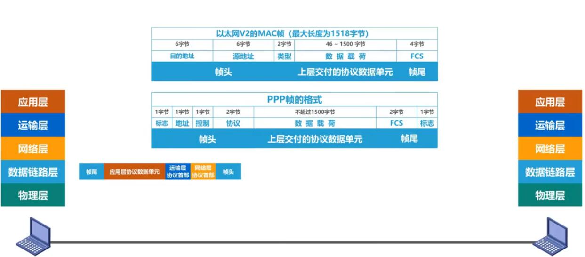

## 封装成帧

 - 封装成帧是指数据链路层给上层交付的协议数据单元添加帧头和帧尾使之成为帧。
   - 帧头和帧尾中包含有重要的控制信息。
   
   - 帧头和帧尾的作用之一就是`帧定界`
      
      但不是每种帧的帧头和帧尾都有`帧定界`标志（1个字节的标志）的，如`以太网V2的MAC帧`，那它是怎么提取每一帧的数据呢？答案是`物理层`会在每一帧前面加上`前导码`，并且规定帧与帧的发送间隔为`96比特时间`所以由前导码和时间间隔就是提取出每一帧了。

- 透明传输是指`数据链路层对上层交付的传输数据没有任何限制`，就好像数据链路层不存在一样。

    - `怎么理解？`
     
        想象一下，如果网络层交给数据链路层的数据中恰好包含一个值与`帧定界`标志值相同的字节，那接收方还能正确接收该帧吗？答案是：`不能`。会受到影响，如果为了不影响，但又不做任何处理，势必会要求`网络层`所传数据中不能包含标志值。那这样就不能称为`透明传输`了。所以`数据链路层`会对数据进行处理，扫描及转义与标志值相同的字节。
    - 两种类型的转义填充：
      - 面向字节的物理链路使用字节填充（或称字符填充）的方法实现透明传输。

      - 面向比特的物理链路使用比特填充的方法实现透明传输。
        > 填充方法：对数据中每5个连续`1`后面添加一个`0`

- 为了提高帧的传输效率，应当使帧的`数据部分的长度尽可能大些`.
- 但考虑到差错控制等多种因素，每一种数据链路层协议都规定了帧的数据部分的长度上限，即`最大传送单元MTU（Maximum Transfer Unit）`.

## 差错检测

- 实际的通信链路都不是理想的，比特在传输过程中可能会产生差错:1可能会变成0面0也可能变成1，这称为`比特差错`
- 在一段时间内，传输错误的比特占所传输比特总数的比率称为`误码率`（Bit Error Rate）.
- 使用差错检测码来检测数据在传输过程中是否产生了比特差错，是数据链路层所要解决的重要问题之一。

### 差错检测方法：
 
  - 奇偶校验
    - 在待发送的数据后面`添加1位奇偶验位`，使整个数据（包括所添加的校验位在内）中"1"的个数为奇数（奇校验）或偶数（偶校验）。
    

    - 由上图示例可以得知：
      - 如果有`奇数个位发生误码`，则奇偶性发生变化，`可以检查出误码`
      - 如果有`偶数个位发生误码`，则奇偶性不发生变化，`不能检查出误码`（也称为漏检）

    可以看出这种校验，漏检率很高。

  - 循环冗余校验CRC（Cyclic Redundancy Check）.
    - 收发双方约定好一个`生成多项式G(x)`
    - 发送方基于待发送的数据和生成多项式计算出差错检测码（`冗余码`）,将其添加到待传输数据的后面一起传输;
    - 接收方通过生成多项式来计算收到的数据是否产生了误码。
    

    【生成多项式举例】
     > G(x) = X^4 + X^2 + X^1 + 1 = `1`* X^4 +`0` * X^3 + `1`* X^2 + `1` * X^1 + `1`* X^0

     由上式得到：生成多项式各项系数构成的比特串为：`10111`
    
    【常用的生成多项式】

    

    【练习】

    
    

    - `检错码`只能检测出帧在传输协和中出现了差错，但并不能定位错误，因此无法纠正错误。
    - 想要纠正传输中的差错，可以使用冗余信息更多的纠错码进行前向纠错。但纠错码的开销比较大，在计算机网络中较少使用。
    - 循环冗余校验CRC有很好的检错能力（漏栓率非常低），虽然计算比较复杂，但非常易于用硬件实现，因此被广泛应用于数据链路层。

## 可靠传输
   - 使用`差错检测技术`（如上面循环冗余校验CRC），接收方的数据链路层就可检测出帧在传输过程中是否产生了误码（比特错误）。
   - 数据链路层向上层提供的服务类型
     - 不可靠传输服务：仅仅丢弃有误码的帧在，其他什么也不做。
     - 可靠传输服务：想办法实现发送端发送什么，接收端就收到什么。
  - 一般情况下，有线链路的误码率比较低，为了减少开销，并不要求数据链路层向上提供可靠传输服务。即使出现了误码，可靠传输的问题由其上层处理。
  - 无线链路易受干扰，误码率比较高，因此要求数据链路层必须向上层提供可靠传输服务。

  - `比特差错`只是传输差错中的一种。
  - 从整个计算机网络体系结构来看，传输差错还包括：分组（帧）丢失，分组（帧）失序，以及分组（帧）重复。
  - 分组丢失，分组失序，以及分组重复这花样新翻传输差错，一般不会出现在数据链路层，面会出现在其上层。
  - 可靠传输服务并不仅局限于数据链路层，其他各层均可选择实现可靠传输。
   

  - 可靠传输的实现比较复杂，开销也比较大，是否使用可靠传输取决于应用需求。
  

    

