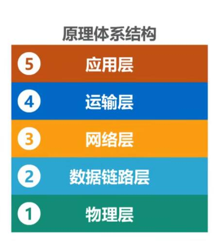

# 计算机网络体系结构

## 常见的计算机网络体系结构

- OSI (开放系统互连参考模型) 体系结构 --法律上的标准。
- 因特网的（TCP/IP）体系结构 -- 事实上的国际标准。

 

 > tip: IP协议的中文意思是网际协议。

 TCP/IP体系结构的网络接口层并没有规定什么具体的内容，目的是可以互连全世界各种不同的网络接口.如：有线的以太网接口，无线的WIFI接口。

  

  
  #### 网际层IP协议是TCP/IP协议中的核心协议:

   - 一方面使用IP协议互连不同的网络接口（IP over everything）
   - 一方面IP协议可以为各种网络应用提供服务（Everything over IP）

  >tip:计算机一般需要实现四层协议，路由一般只有：网络接口层、网际层两层协议。

 因为TCP/IP中网络接口层为了支持不同的网络接口，因此它的网络接口层并没有规定什么具体内容。 `为了学习了解这层原理及结构`采用了折中的方式,综合OSI及TCP/IP的优点，采用了种五层协议的`原理体系结构`来学习计算机网络体系结构。
  

## 计算机网络分层的必要性
- `计算机网络是个非常复杂的系统`。是在最初的ARPANET设计时就提出了分层的设计理念。
- `分层`可将庞大面复杂的问题，转化为若干较小的局部问题，面这些较小的局部问题就比较容易研究和处理。

下面我们按照由简单到复杂的顺序，来看看实现计算机网络要面临哪些主要的问题，以及如何将这些问题划分到相应层次，层层处理。

###  最简单的两台电脑互联：

  

需要考虑的问题有:
 1) 采用怎样的传输媒体（介质 ）
 2) 采用怎样的物理接口。
 3) 使用怎样的信息表示比特0和1

 我们把以上问题都划分到`物理层`

> tip: 传输媒体不属于物理层的一部分。

### 总线型网络:

 

需要考虑的问题：
 1) 如何标识网络中的各主机（主机编址问题，例如MAC地址）
 2) 如何从信号所表示的一连串比特流中区分出地址和数据（也就是数据封装格式问题）
 3)如何协调各主机争用总线（同时使用总线进行传输必定发生碰撞）。
>tip: 总线型网络早以淘汰，我们现在常用的是使用以太网交换机将多台主机互连形成的交换式以太网如下图:

 

 我们把以上问题都划分到`数据链路层`

 ### 小型的互联网:
  

 需要考虑和解决的问题:

 - 如何标识各网络以及网络中的各主机（网络和主机共同编址的问题，例如IP地址）
 - 路由器如何转发分组，如何进行路由选择

 我们把以上问题都划分到`网络层`

   

在数据分组传输中还面临以下问题:

- 如何解决进程之间基于网络的通信问题（是QQ来接收这数据还是浏览器来接收这数据？）
- 出现传输错误（误码，丢包）时，如何处理。

 我们把以上问题都划分到`运输层`

 应用层面我们需要考虑和解决的问题:

 

 - 通过应用进程间的交互来完成特定的网络应用
>
 我们把以上问题都划分到`应用层`

 最终我们来看一下各个分层需要解决的主要问题:

  

## 分层思想举例:

网络中一台主机用浏览器进程向网络中另一台服务器主机发送请求打开主页。

| 网络层        | 作用    |
| --------   | :-----   |
| 客户机应用层 |根据HTTP协议给请求数据添加HTTP报文 |
| 客户机运输层 |给HTTP报文添加一个TCP报文段 |
