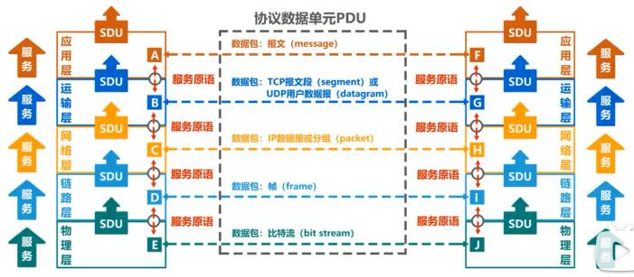
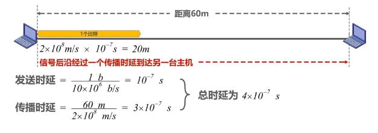

# 计算机网络体系结构

## 常见的计算机网络体系结构

- OSI (开放系统互连参考模型) 体系结构 --法律上的标准。
- 因特网的（TCP/IP）体系结构 -- 事实上的国际标准。

 

 > tip: IP协议的中文意思是网际协议。

 TCP/IP体系结构的网络接口层并没有规定什么具体的内容，目的是可以互连全世界各种不同的网络接口.如：有线的以太网接口，无线的WIFI接口。

  

  
  #### 网际层IP协议是TCP/IP协议中的核心协议:

   - 一方面使用IP协议互连不同的网络接口（IP over everything）
   - 一方面IP协议可以为各种网络应用提供服务（Everything over IP）

  >tip:计算机一般需要实现四层协议，路由一般只有：网络接口层、网际层两层协议。

 因为TCP/IP中网络接口层为了支持不同的网络接口，因此它的网络接口层并没有规定什么具体内容。 `为了学习了解这层原理及结构`采用了折中的方式,综合OSI及TCP/IP的优点，采用了种五层协议的`原理体系结构`来学习计算机网络体系结构。
  

## 计算机网络分层的必要性
- `计算机网络是个非常复杂的系统`。是在最初的ARPANET设计时就提出了分层的设计理念。
- `分层`可将庞大面复杂的问题，转化为若干较小的局部问题，面这些较小的局部问题就比较容易研究和处理。

下面我们按照由简单到复杂的顺序，来看看实现计算机网络要面临哪些主要的问题，以及如何将这些问题划分到相应层次，层层处理。

###  最简单的两台电脑互联：

  

需要考虑的问题有:
 1) 采用怎样的传输媒体（介质 ）
 2) 采用怎样的物理接口。
 3) 使用怎样的信息表示比特0和1

 我们把以上问题都划分到`物理层`

> tip: 传输媒体不属于物理层的一部分。

### 总线型网络:

 

需要考虑的问题：
 1) 如何标识网络中的各主机（主机编址问题，例如MAC地址）
 2) 如何从信号所表示的一连串比特流中区分出地址和数据（也就是数据封装格式问题）
 3)如何协调各主机争用总线（同时使用总线进行传输必定发生碰撞）。
>tip: 总线型网络早以淘汰，我们现在常用的是使用以太网交换机将多台主机互连形成的交换式以太网如下图:

 

 我们把以上问题都划分到`数据链路层`

 ### 小型的互联网:
  

 需要考虑和解决的问题:

 - 如何标识各网络以及网络中的各主机（网络和主机共同编址的问题，例如IP地址）
 - 路由器如何转发分组，如何进行路由选择

 我们把以上问题都划分到`网络层`

   

在数据分组传输中还面临以下问题:

- 如何解决进程之间基于网络的通信问题（是QQ来接收这数据还是浏览器来接收这数据？）
- 出现传输错误（误码，丢包）时，如何处理。

 我们把以上问题都划分到`运输层`

 应用层面我们需要考虑和解决的问题:

 

 - 通过应用进程间的交互来完成特定的网络应用
>
 我们把以上问题都划分到`应用层`

 最终我们来看一下各个分层需要解决的主要问题:

  

## 分层思想举例:

网络中一台主机用浏览器进程向网络中另一台服务器主机发送请求打开主页。

  

1) 客户端

| 网络层        | 作用    |格式|
| --------   | :-----   |:-----:|
| 客户机应用层 |根据HTTP协议将请求数据转为`HTTP报文` | |
| 客户机运输层 |给HTTP报文添加一个TCP首部成为`TCP报文段` （区分应用进程及可靠传输）|   |
| 客户机网络层 |给TCP报文段添加一个IP首部成为`IP数据报 ` (方便路由器转发)| |
| 客户机数据链路层 |给IP数据报添加一个首部及一个尾部使之成为`帧` (方便路由器转发)|   |
| 客户机物理层 |将帧转为比特流并加上前导码|   |

2) 路由器

路由器实现了`物理层`,`数据链路层`，`网络层`三层协议，主要作用是传送过来的数据进行拆包解析，解析目标地址，在路由表中查找映射，再进行三层协议进行封装，传输。

3) 服务器

服务器通过实现的协议对收到的数据进行层层拆包解析，过程与客户端正好相反。

> tip：这只描述了客户端发请求至服务器传输过程，服务器响应客户端过程是一样的。

## 专业术语

 - <b>实体</b> 任何可发送或接收信息的`硬件`或`软件进行`
 - <b>对等实体</b> 收发双方相同层次中的实体

 

如收发双方的网卡，应用层客户端的浏览器软件与服务端的apache等服务器软件

 - <b>协议</b> 控制两个对等实体进行逻辑通信的规则的集合。
 - <b> 协议三要素</b> `语法` `语义` `同步`
    1) 语法定义所交换信息格式，如IP数据报格式：
     
    2) 语义 定义收发双方所要完成的操作。
    2) 同步 定义收发双方的时序关系。
 - 在协议的控制下，两个对待实体间的逻辑通信使得本层能够向上一层提供服务。即实现本层协议，还需要使用下面一层所提供的服务。
  
 - 协议是`水平的`，服务是`垂直的`
 - 实体看得风相邻下层提供的服务，但并不知道实现该服务的具体协议。也就是说，下面的协议对上央的实体是“透明”的

 - `服务访问点` 在同一系统中`相邻两层的实体交换信息的逻辑接口`，用于区分不同的服务类型。
   - 数据链路层的服务访问点为帧的的“类型”字段。
   - 网络层的服务访问点为IP数据报首部中的“协议字段”
   - 运输层的服务访问点为“端口号”
- `服务原语` 上层使用下层所提供的服务必须通过与下层交换一些命令，这些命令称为服务原语。
- 协议数据单元PDU, `对等层次之间传送的数据包`称为该层的协议数据单元。
- 服务数据单元SDU `同一系统内，层与层之间交换的数据包`称为服务数据单元。
- 多个SDU可以合并成为一个PDU，一个SDU也可划分为几个PDU
 
 

 练习：

 1) 在OSI参考模型中，自下而上第一个提供端到端服务的层次是：`传输层`

 2) TCP/IP参考模型的网络提供的是：`无连接不可靠的数据报服务`
 3) `协议的内部实现细节`不属于网络体系结构所描述的内容。
 4) 在TCP/IP体系结构中，直接为ICMP提供服务的协议是：`IP`
 5) 在OSI参考模型中，下列功能需由应用层的相邻层实现的是`数据格式转换`
 6) 在OSI参考模型中，直接为会话层提供服务的是`传输层`
 7) 通过POP3协议接收邮件时，使用的传输层服务类型是：`有连接可靠的数据传输服务`
 8) 集线器的最高功能层为`物理层`编号为`1`,交换机实现的最高功能层为`数据链路层`编号为`2`,路由器实现最高功能层为`网络层`编号为`3`
 9) TCP/IP体系结构的网络接口层对应OSI体系结构的`数据链路层`和`物理层`

时延：

1) 两主机间的链路长度为60m,链路带宽为10Mb/s,信号的传播速率为2.0*10^8 m/s,其中一台主机线另一台主机发送1b信息，当主机接收完该信息时共耗费多长 时间？

  