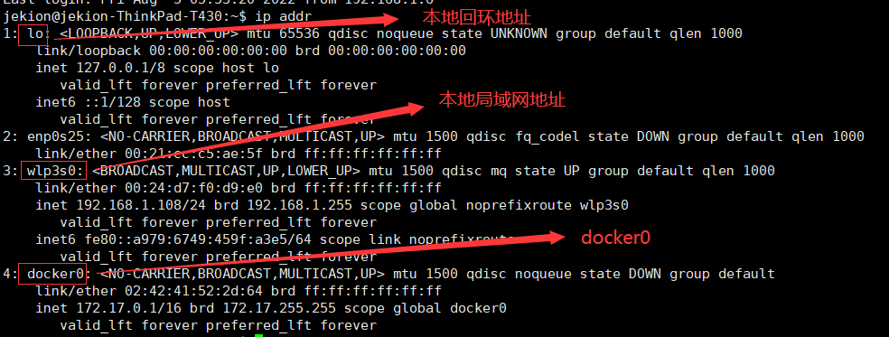

### docker网络

#### docker0

``` bash
# 查看ip 地址
ip addr

```



我们只要安装了docker，就会有一个网卡docker0桥接模式，使用的技术是`evth-pair`技术。

```bash
#启动一个容器
docker run -d -P --name tomcatTest tomcat
#查看容器ip地址
docker inspect 容器id --format='{{.NetworkSettings.IPAddress}}'
```

我们可以发现，在宿主机上可以ping通容器ip

原理：

我们每启动一个docker 容器，docker 就会给容器分配置一个ip。并在宿主机上虚拟一张网卡，并与容器内桥接。（evth-pair技术）。

不尽宿主机与容器之前可以ping通，容器与容器之间也可以ping通，如下

```bash
#查看容器1的ip
$ docker inspect fa70c216cc35 --format='{{.NetworkSettings.IPAddress}}'
172.17.0.3
#查看容器2的ip
$ docker inspect e2ec3735866f --format="{{.NetworkSettings.IPAddress}}"
172.17.0.3
#在容器2内ping容器1
$ docker exec -it e2ec3735866f ping 172.17.0.3
PING 172.17.0.3 (172.17.0.3) 56(84) bytes of data.
64 bytes from 172.17.0.3: icmp_seq=1 ttl=64 time=0.283 ms
64 bytes from 172.17.0.3: icmp_seq=2 ttl=64 time=0.126 ms
64 bytes from 172.17.0.3: icmp_seq=3 ttl=64 time=0.119 ms

```

原理：

我们可以把网卡`docker0`想像成局域网中的路由，启动一个容器，好比在这个“路由器”中插入一根网线连接一个设备；`docker01`维护着容器的路由表。


Docker中的所有的网络接口都是虚拟的，虚拟的转发效率高。

只要容器删除，对应网桥一对就会被删除。

#### 容器之间可以通过名称来ping通：--link

```bash
#启动容器时带上--link
docker run -d -P --name tomcat02 --link tomcat03 mytomcat:v1.1
#在容器tomcat02中ping tomcat03 可以ping通
docker exec -it tomcat02 ping tomcat03
```

### docker network

我们可以通过`docker network`查看docker的网络情况

```bash
docker network ls
#结果
NETWORK ID     NAME      DRIVER    SCOPE
4797b6bf117d   bridge    bridge    local
67c91e8c3906   host      host      local
a2a9851d5629   none      null      local
#其中 bridge 就是docker0网卡

#查看docker01网络情况
docker network inspect 4797b6bf117d
#可以查看docker01,及所有连接容器的ip信息
```

--link 原理

实际是修改了容器内部的hosts文件。我们可以输出hosts看一下：

```bash
docker exec -it 01386847d44a cat /etc/hosts
#结果
127.0.0.1	localhost
::1	localhost ip6-localhost ip6-loopback
fe00::0	ip6-localnet
ff00::0	ip6-mcastprefix
ff02::1	ip6-allnodes
ff02::2	ip6-allrouters
172.17.0.2	e2ec3735866f e2ec3735866f jekiontomcat 
172.17.0.3	01386847d44a

```

> --link 不建议使用，因为只有配置了--link的容器可以用名称ping link目标容器，目标容器不能反向通过名称ping源容器。

### 自定义网络